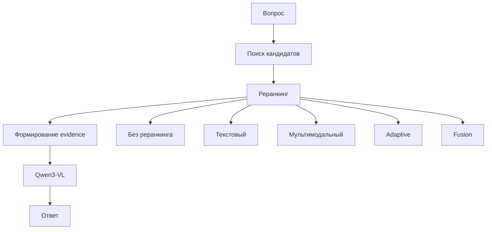

# Разработка алгоритма реранкинга мультимодальных данных

> Исследовательский репозиторий, посвящённый контролируемой оценке мультимодального реранкинга как отдельного компонента систем Document Question Answering.

В работе сравниваются `No Reranker`, `Text Reranker`, `Multimodal Reranker`, `Fusion Strategies` и `Adaptive Reranking` на наборе данных DocBench. Оценка проводится по answer-level метрикам и end-to-end latency, что позволяет анализировать не только качество ответа, но и вычислительные затраты реранкинга.

В современных системах Document QA и Multimodal RAG часто исследуются retrieval, reasoning, agentic evidence search и возможности VLM. В этой работе объект исследования намеренно сужен до этапа **мультимодального реранкинга**: насколько он улучшает качество ответа, чем отличается от текстового реранкинга и какую цену добавляет по latency.

Проект фиксирует полный Document QA pipeline и использует retrieval, evidence construction и Qwen3-VL как экспериментальный контур для измерения вклада reranking stage.

[](pyproject.toml)
[](#dataset--models)
[](#project-overview)
[](article_final.md)

[](#основная-идея-исследования)
[](#pipeline)
[](#results)
[](#dataset--models)
[](#dataset--models)
[](#dataset--models)
[](#dataset--models)
[](#results)
[](#results)

---

## Navigation

| Section | Link |
| --- | --- |
| Основная идея исследования | [Основная идея исследования](#основная-идея-исследования) |
| Project Overview | [Project Overview](#project-overview) |
| Research Questions | [Research Questions](#research-questions) |
| Scientific Contribution | [Scientific Contribution](#scientific-contribution) |
| Pipeline | [Pipeline](#pipeline) |
| Dataset & Models | [Dataset & Models](#dataset--models) |
| Results | [Results](#results) |
| Key Findings | [Key Findings](#key-findings) |
| Repository Structure | [Repository Structure](#repository-structure) |
| Reproducibility | [Reproducibility](#reproducibility) |
| Основной вывод | [Основной вывод](#основной-вывод) |
| Documentation | [Documentation](#documentation) |

---

<a id="основная-идея-исследования"></a>

## Основная идея исследования

Большинство современных работ по Multimodal RAG исследуют retrieval, agentic search, reasoning или возможности больших мультимодальных моделей. В данной работе объект исследования намеренно ограничен этапом мультимодального реранкинга. Остальные компоненты конвейера фиксируются, что позволяет количественно оценить вклад реранкинга в качество итогового ответа и вычислительные затраты системы.

---

<a id="project-overview"></a>

## Project Overview

**Document Question Answering** решает задачу ответа на вопрос по документу. Для PDF-документов релевантная evidence может находиться не только в тексте, но и в таблицах, рисунках, captions, OCR-слоях и layout-структуре страницы.

В этом проекте исследуется не общий Multimodal RAG и не сравнение VLM как самостоятельная задача. Центральная постановка:

```text
Как влияет reranking stage на answer-level качество Document QA
и какой latency trade-off возникает при переходе
от отсутствия реранкинга к текстовому и мультимодальному реранкингу?
```

Экспериментальная линия построена как controlled comparison:

```text
No Reranker
→ Text Reranker
→ Multimodal Reranker
→ Adaptive Reranking
```

Качество оценивается на уровне ответа, а не только на retrieval metrics. Для каждой конфигурации учитываются `Mean F1`, `F1 > 0.5`, `Exact Match`, качество по типам `multimodal-t` / `multimodal-f` и end-to-end latency.

---

<a id="research-questions"></a>

## Research Questions

| ID | Question |
| --- | --- |
| **RQ1** | Улучшает ли мультимодальный реранкинг качество ответа по сравнению с отсутствием реранкинга? |
| **RQ2** | Насколько мультимодальный реранкинг превосходит текстовый реранкинг в Document QA pipeline? |
| **RQ3** | Какой компромисс между answer quality и latency создаёт reranking stage? |
| **RQ4** | Может ли Adaptive Reranking снижать latency без существенной потери качества? |

---

<a id="scientific-contribution"></a>

## Scientific Contribution

- Контролируемая оценка мультимодального реранкинга как отдельного компонента конвейера Document QA.
- Сравнение режимов `No Reranker`, `Text Reranker` и `Multimodal Reranker` в едином экспериментальном контуре.
- Анализ качества ответа на уровне финального ответа и вычислительных затрат по latency.
- Исследование стратегий score fusion для мультимодального реранкинга.
- Дополнительная оценка `Adaptive Reranking` как механизма снижения latency.
- Анализ влияния candidate generation и evidence construction на эффективность reranking stage.

Важно: проект не заявляет создание нового VLM, нового retriever-а или новой архитектуры реранкера. Вклад состоит в исследовательской постановке, воспроизводимом pipeline и экспериментальной оценке reranking stage.

---

<a id="pipeline"></a>

## Pipeline



Исследуемый блок — **Reranking**. Остальные компоненты фиксируют экспериментальную среду:

- retrieval формирует candidate pool;
- reranker переупорядочивает страницы-кандидаты;
- evidence construction выбирает page text, OCR, captions, table text, full page и layout crop;
- Qwen3-VL генерирует финальный ответ;
- evaluation измеряет answer-level качество и latency.

---

<a id="dataset--models"></a>

## Dataset & Models

Эксперименты выполнены на мультимодальном подмножестве **DocBench**.

| Parameter | Value |
| --- | ---: |
| PDF-документы в DocBench | 229 |
| Вопросы в полном DocBench | 1,102 |
| Используемые multimodal questions | 308 |
| Типы вопросов | `multimodal-t`, `multimodal-f` |

| Component | Models |
| --- | --- |
| Retrievers | Nemotron image retrieval, ColPali / ColVision, BM25, BGE text encoders |
| Rerankers | Nemotron VL Reranker, BGE-reranker-base, BGE-reranker-large, Jina, MiniLM |
| VLM | Qwen3-VL-30B, Qwen3-VL-8B |
| Evidence | page text, OCR, captions, table text, full page, layout crop |

---

<a id="results"></a>

## Results

Основные результаты взяты из [reports/tables/paper_multimodal_308.md](reports/tables/paper_multimodal_308.md), [reports/experiment_summary/](reports/experiment_summary/) и дополнительного прогона Adaptive Reranking.

| Категория | Метод | Mean F1 | Latency |
| --- | --- | ---: | ---: |
| **Baseline** | Nemotron full image+text, без реранкера | 0.6784 | 3.4263s |
| **Text** | BM25 + BGE-reranker-large | 0.5497 | 1.2344s |
| **Multimodal** | Nemotron full image+text + VL reranker | **0.7023** | 13.6441s |
| **Adaptive** | Adaptive image/text-image VL reranking | 0.7009 | 9.7882s |
| **Fusion** | Fusion Nemotron no image reranker | 0.6575 | **2.5080s** |

Полные результаты доступны в [reports/tables](reports/tables/) и [reports/experiment_summary](reports/experiment_summary/).

Текстовый реранкинг показывает более низкие результаты на мультимодальных вопросах DocBench, поскольку не использует визуальные признаки документа и работает только с текстовым представлением страниц.

### Fusion Strategies

Fusion исследуется как дополнительный механизм объединения retrieval score и сигналов реранкинга. Цель — поиск конфигураций с более выгодным компромиссом между качеством ответа и вычислительными затратами.

---

<a id="key-findings"></a>

## Key Findings

- Мультимодальный реранкинг улучшает качество Document QA по сравнению с no-reranker baseline.
- Средний выигрыш от reranking составляет около `+0.043 Mean F1`.
- Лучший результат статьи: `Mean F1 = 0.7023` для Nemotron full image+text + VL reranker + Qwen3-VL-30B.
- Text-only reranking заметно уступает мультимодальному reranking в данной постановке.
- `Full page + layout crop` является наиболее эффективной evidence strategy.
- Adaptive Reranking сохраняет качество почти на уровне лучшей конфигурации (`0.7009` против `0.7023`) и снижает среднюю latency с `13.6441s` до `9.7882s`.
- Visual-heavy и text/table-heavy вопросы требуют разных reranking strategies, что мотивирует adaptive routing.

---

<a id="repository-structure"></a>

## Repository Structure

```text
reranking_multimodal_data/
├── article_final.md
├── configs/
│   └── experiments/
├── data/
├── docs/
├── paper_ieee/
├── reports/
│   ├── adaptive_reranking/
│   ├── experiment_summary/
│   ├── fusion_weight_search/
│   ├── tables/
│   └── threshold_skip/
├── results/
├── scripts/
├── src/
│   ├── cropping/
│   ├── evaluation/
│   ├── generation/
│   ├── mmrag/
│   ├── reranking/
│   └── retrieval/
└── tests/
```

| Path | Purpose |
| --- | --- |
| `article_final.md` | Итоговая русскоязычная статья |
| `configs/experiments/` | YAML-конфиги воспроизводимых экспериментов |
| `data/` | Данные, индексы и промежуточные evidence artifacts |
| `docs/` | Разделы статьи, novelty-check, обзоры и аудиты |
| `paper_ieee/` | IEEE Conference version sources |
| `reports/tables/` | Итоговые таблицы для статьи |
| `reports/experiment_summary/` | Агрегированные экспериментальные результаты |
| `results/` | Выходы отдельных запусков |
| `scripts/` | Entry points для экспериментов и агрегации |
| `src/reranking/` | Реализации reranking, fusion, adaptive и threshold-skip режимов |
| `tests/` | Минимальные тесты метрик и базовой инфраструктуры |

---

<a id="reproducibility"></a>

## Reproducibility

### Installation

```bash
git clone https://github.com/st-kirill-v/reranking_multimodal_data.git
cd reranking_multimodal_data
uv venv
uv sync
```

Для Qwen3-VL через OpenAI-compatible backend:

```bash
export OPENAI_COMPAT_API_KEY="..."
```

Windows PowerShell:

```powershell
$env:OPENAI_COMPAT_API_KEY="..."
```

### Best Multimodal Reranker

```bash
python scripts/run_experiment.py \
  --config configs/experiments/image_text_full_308_nemotron_qwen3vl30b.yaml
```

### No-Reranker Baseline

```bash
python scripts/run_experiment.py \
  --config configs/experiments/image_text_full_308_nemotron_no_reranker_qwen3vl30b.yaml
```

### Text-Reranker Baseline

```bash
python scripts/run_experiment.py \
  --config configs/experiments/text_reranker_308_bge_large_qwen3vl30b.yaml
```

### Adaptive Reranking

```bash
python scripts/run_experiment.py \
  --config configs/experiments/adaptive_reranking_308_qwen3vl30b.yaml
```

### Fusion Weight Search

```bash
python scripts/run_fusion_weight_search.py
```

### Threshold Skip Preliminary Grid

```bash
python scripts/run_threshold_skip_grid.py
```

### Aggregate Paper Tables

```bash
python scripts/build_experiment_summary_tables.py
```

Expected artifacts:

```text
reports/tables/paper_multimodal_308.csv
reports/tables/paper_multimodal_308.md
reports/experiment_summary/
```

---

<a id="основной-вывод"></a>

## Основной вывод

Мультимодальный реранкинг повышает качество ответа в Document QA pipeline: лучший результат достигает `Mean F1 = 0.7023`. При этом `Adaptive Reranking` сохраняет практически то же качество (`0.7009`) и снижает latency примерно на 28% относительно лучшей мультимодальной конфигурации. Эти результаты показывают, что реранкинг следует рассматривать как самостоятельный проектный компонент систем Document QA, а не только как вспомогательную деталь retrieval pipeline.

---

<a id="documentation"></a>

## Documentation

| Resource | Description |
| --- | --- |
| [article_final.md](article_final.md) | Итоговая русскоязычная статья |
| [paper_ieee/](paper_ieee/) | IEEE Conference версия статьи |
| [reports/tables/paper_multimodal_308.md](reports/tables/paper_multimodal_308.md) | Основная таблица результатов для статьи |
| [reports/experiment_summary/](reports/experiment_summary/) | Агрегированные результаты экспериментов |
| [docs/novelty_check_multimodal_reranking.md](docs/novelty_check_multimodal_reranking.md) | Проверка научной новизны controlled multimodal reranking |
| [docs/docbench_literature_review.md](docs/docbench_literature_review.md) | Обзор работ, связанных с DocBench |
