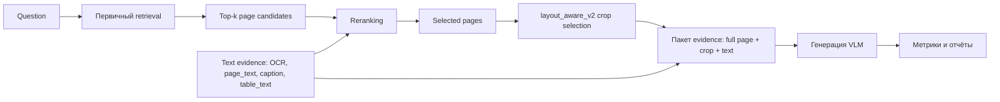
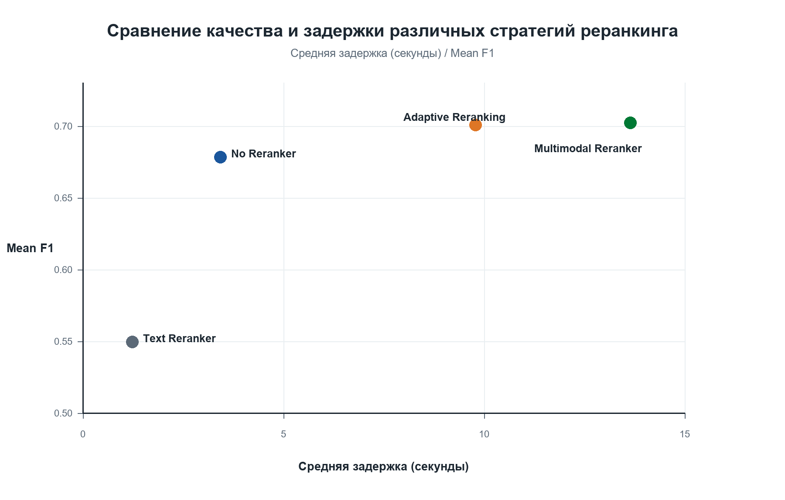
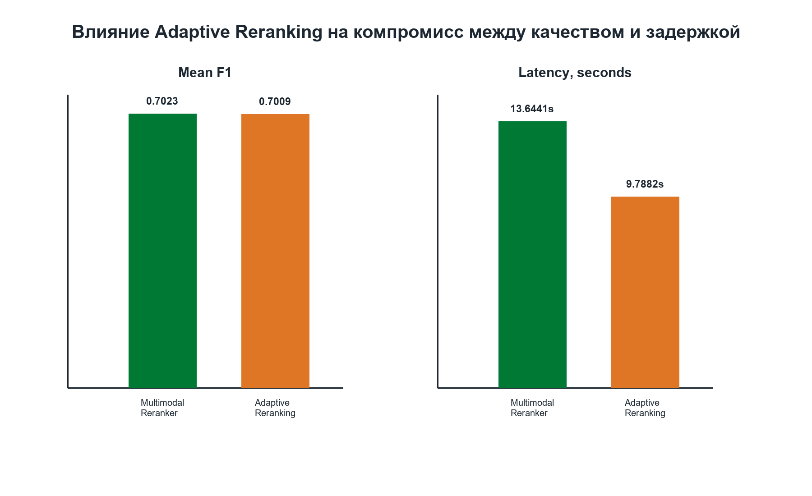
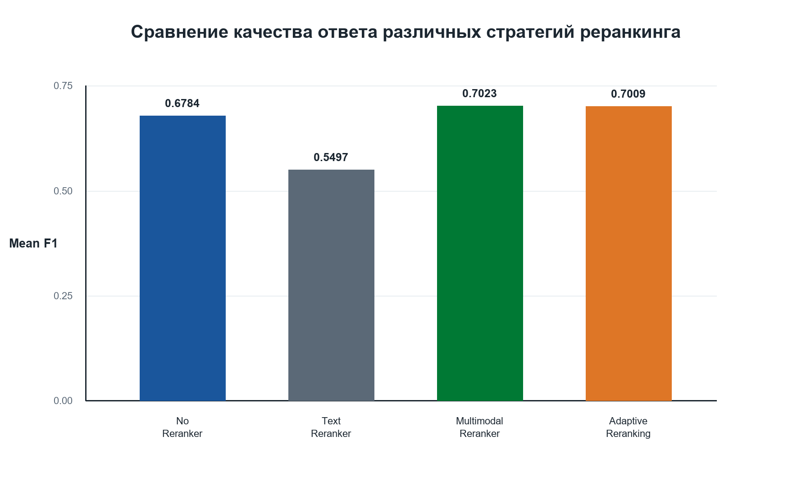

# Аннотация

Современные системы Document Question Answering и Multimodal RAG всё чаще работают с PDF-документами, содержащими не только линейный текст, но и таблицы, графики, диаграммы, подписи, визуальные области и сложную пространственную структуру страницы. В таких условиях качество ответа определяется не только возможностями генеративной модели, но и тем, насколько точно система выбирает релевантные страницы и evidence перед генерацией. В работе исследуется задача мультимодального реранкинга как ключевого этапа document QA pipeline, связывающего первичный retrieval с последующим формированием ответа. Разработана и исследована мультимодальная стратегия реранкинга, интегрирующая генерацию кандидатов, текстовый реранкинг, мультимодальный реранкинг, layout-aware формирование evidence и генерацию ответа на основе VLM. Оценка проводится на мультимодальном подмножестве DocBench и строится вокруг последовательного сравнения режимов `No Reranker`, `Text Reranker`, `Multimodal Reranker` и дополнительного режима `Adaptive Reranking` с учётом качества ответов и latency. Полученные результаты показывают, что реранкинг стабильно улучшает качество по сравнению с pipeline без реранкинга, а мультимодальный реранкинг превосходит text-only реранкинг на вопросах, требующих визуального и layout-aware evidence. Наиболее сильная конфигурация достигает Mean F1 0.7023, при этом рост качества сопровождается увеличением latency. Дополнительный эксперимент с Adaptive Reranking показывает близкое качество Mean F1 0.7009 при снижении средней latency с 13.6441 до 9.7882 seconds, то есть примерно на 28%. Также показано, что визуальная генерация кандидатов и стратегия `full page + layout crop` создают наиболее благоприятные условия для эффективного мультимодального реранкинга. Результаты могут использоваться при построении Document QA и Multimodal RAG систем, где требуется надёжный выбор evidence из визуально насыщенных PDF-документов.


# Ключевые слова

Document Question Answering,
Multimodal Reranking,
Multimodal RAG,
Document Retrieval,
PDF Documents,
Visual Retrieval,
Evidence Construction,
Large Vision-Language Models,
DocBench,
Layout-Aware Processing,
Information Retrieval


# 2 Введение

## 2.1 Мотивация задачи

Цифровые организации всё чаще хранят знания в виде PDF-документов: научных статей, финансовых отчётов, нормативных документов, презентаций, технических руководств и аналитических материалов. Такие документы становятся естественным источником информации для question answering систем, поскольку пользователь ожидает не просто полнотекстовый поиск, а точный ответ на вопрос, обоснованный содержанием конкретного документа. Однако PDF-документы существенно отличаются от обычных текстовых корпусов. Их содержание распределено между абзацами, таблицами, диаграммами, графиками, подписями, визуальными элементами, заголовками, сносками и пространственным расположением блоков на странице. Поэтому задача document question answering требует не только языкового понимания, но и анализа визуальной структуры документа.

Классические retrieval-augmented generation системы обычно предполагают, что релевантный evidence можно извлечь из линейного текста. Такая предпосылка оказывается ограниченной для визуально насыщенных PDF. Ответ может находиться в ячейке таблицы, в оси графика, в подписи к рисунку, в заголовке страницы, в легенде диаграммы или в комбинации текстового и визуального evidence. Более того, один и тот же документ может содержать несколько похожих таблиц или повторяющихся сущностей, поэтому системе необходимо не только найти правильный документ, но и выбрать правильную страницу, область страницы, строку, колонку или визуальный элемент. Ошибка на любом этапе приводит к неверному ответу даже тогда, когда сама generative model достаточно сильна.

Современные benchmark-и для document QA подчёркивают эту сложность. DocVQA сформулировал задачу ответа на вопросы по изображениям документов и показал, что layout и визуальная структура являются важными источниками информации [1]. Более новые benchmark-и, такие как MMLongBench-Doc и DocBench, расширяют постановку на длинные и реальные PDF-документы, где evidence может быть распределён между текстом, таблицами, графиками, изображениями, layout-структурами и метаданными [5, 6]. В такой постановке качество системы определяется не только мощностью VLM, но и тем, насколько хорошо pipeline ранжирует найденные страницы и выбирает evidence перед генерацией ответа. Поэтому реранкинг становится центральным этапом: он связывает этап первичного поиска с последующей генерацией ответа и определяет, какие страницы, crops и текстовые признаки будут доступны модели ответа.

Особую сложность представляет практическое использование таких систем. Для исследовательского прототипа можно выбрать наиболее ресурсоёмкую конфигурацию с визуальным retrieval, мультимодальным reranker и большой VLM. В прикладных условиях важны также latency, стоимость inference и воспроизводимость. Поэтому задача состоит не только в выборе наиболее сильного reranker, но и в понимании условий, при которых реранкинг оправдывает свою вычислительную стоимость. Это делает необходимым систематическое сравнение режимов `No Reranker`, `Text Reranker` и `Multimodal Reranker` при разных retriever, способах формирования evidence и VLM-моделях. Дополнительно рассматривается Adaptive Reranking как практический способ снижать вычислительные затраты за счёт условного применения дорогого visual-language reranker.

Основная гипотеза работы заключается в том, что мультимодальный реранкинг является ключевым компонентом document QA pipeline, поскольку именно он определяет, какие страницы, визуальные области и текстовые evidence будут доступны модели генерации ответа.

## 2.2 Ограничения существующих подходов

Существующие подходы к document QA можно условно разделить на несколько групп. Text-only retrieval pipeline извлекают текст из PDF, строят текстовый индекс и подают найденные фрагменты в LLM или VLM. Такие системы просты, быстры и хорошо совместимы с классическими text rerankers. Однако они теряют часть информации, которая выражена визуально: структуру таблиц, расположение элементов, связи между заголовками и ячейками, графические подписи, диаграммы и visual cues. В результате текстовый реранкинг может быть сильным baseline для вопросов, где ответ явно записан в тексте, но оказывается ограниченным для table-heavy и figure-heavy вопросов.

OCR-only pipeline частично снимают эту проблему, поскольку позволяют извлечь текст из отрендеренных страниц и scanned documents. Тем не менее OCR не сохраняет весь визуальный контекст. Ошибки распознавания, потеря табличной структуры, смешение колонок и отсутствие явного представления layout могут приводить к неверному формированию evidence. Даже если OCR корректно распознаёт отдельные токены, система всё ещё должна понять, к какой таблице, строке, колонке, рисунку или странице относится найденный фрагмент. Поэтому OCR является важным источником evidence, но не заменяет визуальный retrieval и visual-language reasoning.

Другой класс работ предлагает новые архитектуры document understanding или multimodal RAG frameworks. LayoutLMv3, Donut и Pix2Struct демонстрируют ценность специализированных document understanding models, а MuRAG, M2RAG, MHier-RAG и RAG-Anything развивают retrieval-augmented generation для мультимодальных данных [2, 3, 4, 14, 15, 16, 17]. Эти работы существенно продвигают область, однако часто фокусируются либо на новой модели, либо на целостном end-to-end framework. В таком случае становится сложнее ответить на практический инженерный вопрос: какой именно компонент pipeline даёт основной вклад в качество, а какой создаёт вычислительный bottleneck.

Даже в работах по visual document retrieval, таких как ColPali и ViDoRe, основной фокус часто находится на качестве retrieval, тогда как последующая генерация ответа, упаковка evidence и анализ latency рассматриваются менее подробно [8]. Между тем в реальной RAG-системе retrieval является только первым этапом. После него требуется реранкинг, выбор страниц и crops, формирование multimodal context, подача evidence в VLM и вычисление answer-level metrics. Следовательно, высокая релевантность retrieval не гарантирует высокое итоговое качество ответа, если reranker не способен выбрать evidence, полезный именно для генерации ответа.

## 2.3 Исследовательский разрыв

Обзор литературы показывает, что существующие исследования покрывают отдельные части задачи: document QA benchmark-и фиксируют сложность визуально структурированных документов; visual retrieval models улучшают поиск релевантных страниц; multimodal RAG frameworks объединяют разные типы evidence; reranking models повышают качество ранжирования. Visual retrieval уже активно развивается, а multimodal RAG frameworks уже существуют, однако роль мультимодального реранкинга изучена существенно слабее. В частности, относительно мало работ рассматривает мультимодальный реранкинг как центральный объект исследования внутри единого воспроизводимого document QA pipeline.

Ключевой пробел состоит в том, что retrieval часто оценивается отдельно от генерации ответа. Такая оценка полезна, но она не показывает, как reranker преобразует набор найденных страниц в evidence, пригодный для генерации ответа. Аналогично, end-to-end frameworks демонстрируют возможности целой системы, но не всегда позволяют изолировать влияние самого этапа реранкинга от окружения: retriever первичного этапа, формирование evidence и VLM-модель. Для multimodal PDF QA это особенно важно, поскольку ошибки могут возникать на разных уровнях: система может найти правильный документ, но неверно переупорядочить страницы; выбрать релевантную страницу, но не поднять страницу с нужной таблицей; получить правильный crop, но не передать VLM достаточный текстовый context. Поэтому отсутствует систематический анализ влияния reranking на конечное качество ответов в условиях, где retrieval, формирование evidence и модель генерации контролируются внутри одной экспериментальной схемы.

Недостаточно изученным остаётся и влияние формирования evidence на эффективность reranking. Визуальная страница, layout-aware crop, OCR, page text, captions и table text несут разные типы информации. Эти признаки могут подаваться в text reranker, multimodal reranker, VLM input или использоваться в score-level fusion. Однако неочевидно, в каких условиях текстовый reranking достаточен, а в каких требуется мультимодальный реранкинг с изображением страницы. Кроме того, расширение evidence повышает стоимость обработки и может ухудшать latency, особенно если используется visual-language reranker.

Таким образом, исследовательский разрыв связан не с отсутствием сильных моделей как таковых, а с недостатком систематического анализа мультимодального реранкинга в окружении реального document QA pipeline. Необходимо оценить, как режимы `No Reranker`, `Text Reranker` и `Multimodal Reranker` ведут себя при разных retriever, стратегиях формирования evidence, VLM-моделях и latency constraints. Настоящая работа направлена на этот пробел: она рассматривает реранкинг как механизм выбора evidence и анализирует его влияние на качество ответов и latency в рамках воспроизводимого pipeline на мультимодальном подмножестве DocBench. Особое внимание уделяется сравнению text-only реранкинга и мультимодального реранкинга в сопоставимых условиях retrieval.

## 2.4 Исследовательские вопросы

Исследование организовано вокруг шести вопросов, каждый из которых раскрывает эффективность reranking в разных условиях document QA pipeline.

**RQ1. Как retriever первичного этапа влияет на последующую эффективность reranking в multimodal DocBench: text-based retrieval, ColPali/ColVision или Nemotron image retrieval?** Этот вопрос рассматривает retriever как окружение для reranker: качество начального набора кандидатов определяет, какие страницы может переупорядочить второй этап.

**RQ2. Насколько реранкинг повышает качество и какую стоимость по latency он добавляет?** Этот вопрос является центральным: он сравнивает `No Reranker`, текстовый реранкинг и мультимодальный реранкинг через итоговое качество ответа и inference latency.

**RQ3. Как VLM-модель влияет на наблюдаемый эффект reranking?** Этот вопрос рассматривает Qwen3-VL-30B и Qwen3-VL-8B не как самостоятельный объект сравнения, а как модели генерации, через которые проявляется качество evidence, выбранного reranker.

**RQ4. Улучшает ли text evidence эффективность reranking при добавлении в reranker и VLM input?** Этот вопрос проверяет, помогает ли использование OCR, page text, captions и table text мультимодальному reranker точнее выбирать evidence.

**RQ5. Какие конфигурации реранкинга дают лучший компромисс между качеством и скоростью?** Этот вопрос отражает практическую сторону задачи: в реальных системах важно определить, когда дополнительный reranking оправдывает стоимость по latency и когда его можно применять условно через adaptive route selection.

**RQ6. Отличается ли эффект reranking на multimodal-t и multimodal-f вопросах?** Этот вопрос разделяет table/text-heavy и figure/visual-heavy случаи, поскольку разные типы evidence могут по-разному требовать текстовый реранкинг или мультимодальный реранкинг.

## 2.5 Вклад работы

Работа вносит четыре основных вклада в исследование мультимодального реранкинга для document question answering.

Во-первых, разработан и оценён модуль мультимодального реранкинга для document question answering. В отличие от работ, которые оценивают только retrieval relevance или только end-to-end framework, данное исследование выстраивает линию сравнения `No Reranker -> Text Reranker -> Multimodal Reranker` и связывает её с этапом генерации ответа.

Во-вторых, в единой схеме оценки сравниваются text rerankers и visual-language rerankers при разных retriever первичного этапа и VLM-моделей. Такой дизайн позволяет рассматривать retriever и VLM не как самостоятельные цели статьи, а как факторы, влияющие на эффективность реранкинга.

В-третьих, исследуются стратегии формирования evidence и layout-aware document processing как входные условия для reranking. Pipeline рассматривает не только полные изображения страниц, но и layout-aware crops, OCR, page text, captions и table text, что позволяет анализировать, какой evidence помогает reranker выбирать страницы и области, полезные для ответа.

В-четвёртых, работа совместно оценивает качество ответа и latency для вариантов reranking. Вместо выбора единственной максимальной по качеству конфигурации исследование рассматривает reranker ablations, варианты без реранкинга и Adaptive Reranking, чтобы определить, когда мультимодальный реранкинг даёт достаточный выигрыш относительно своей вычислительной стоимости.


# 3 Обзор литературы

В этом разделе рассматриваются работы, связанные с мультимодальным вопросно-ответным анализом документов, визуальным поиском по документам, мультимодальным RAG и reranking. В обзор включены только существующие статьи и официальные источники. Если конкретный результат или ограничение не указаны напрямую в статье или на странице источника, такое ограничение формулируется как отличие относительно нашей постановки задачи, а не как заявленная авторами слабая сторона работы.

## 3.1 Document Question Answering

Document Question Answering (DocQA) расширяет классическое reading comprehension на визуально структурированные документы, где текст встроен в макеты, таблицы, формы, рисунки и сканированные страницы. Ранние benchmark-и для document VQA, такие как **DocVQA**, сформулировали задачу ответа на вопросы на естественном языке по изображениям документов и показали, что модели должны понимать структуру документа, а не только читать плоский OCR-текст. Mathew et al. сообщают о большом разрыве между модельными baseline-ами и человеком: human accuracy составляет 94.36%, что показывает сложность layout- и структурного reasoning даже тогда, когда ответ визуально присутствует на странице [1].

Вторая линия работ сосредоточена на архитектурах для document understanding. **LayoutLMv3** объединяет text masking и image masking objectives для Document AI и применяется как к text-centric задачам, например form understanding и document VQA, так и к image-centric задачам, включая document classification и layout analysis [2]. **Donut** устраняет зависимость от OCR, формулируя document understanding как OCR-free image-to-sequence задачу и тем самым снижая стоимость OCR, его негибкость и распространение OCR-ошибок [3]. **Pix2Struct** обобщает visual language understanding за счёт pretraining image-to-text модели на screenshot parsing и показывает, что единая модель может переноситься между документами, иллюстрациями, UI-скриншотами и natural images [4]. Эти методы демонстрируют важность визуального моделирования документов, но в основном остаются model-centric и сами по себе не решают large-corpus retrieval, page selection и production-style RAG по множеству PDF-страниц.

Более новые benchmark-и выходят за рамки single-page или task-specific document QA. **MMLongBench-Doc** оценивает long-context document understanding на 130 длинных PDF и 1,062 экспертно размеченных вопросах, где evidence может находиться в тексте, изображениях, графиках, таблицах, layout-структурах и номерах страниц. Результаты показывают, что даже сильные LVLM испытывают трудности: GPT-4o достигает только 42.7 F1 в опубликованной оценке, а многие LVLM уступают LLM, которым подают lossy OCR text [5]. **DocBench** особенно близок к нашей экспериментальной постановке: он содержит 229 реальных PDF-документов и 1,102 вопроса из пяти доменов и четырёх типов вопросов, включая text-only, multimodal, metadata и unanswerable questions [6]. В нашей работе используется мультимодальное подмножество DocBench, а основной фокус сделан на retrieval, reranking, layout-aware выборе evidence и генерации ответа для table/text-heavy и figure/visual-heavy вопросов.

## 3.2 Мультимодальный retrieval

Multimodal retrieval изучает поиск релевантного evidence в условиях, когда запросы и документы могут включать текст, изображения или смешанный мультимодальный контент. В текстовом retrieval benchmark **BEIR** стал важной точкой отсчёта для zero-shot retrieval и показал, что BM25 остаётся сильным baseline-ом, тогда как reranking и late-interaction архитектуры дают высокое качество ценой большей вычислительной стоимости [7]. Это мотивирует включение BM25 и text reranker baseline-ов в нашу работу, однако text-only retrieval недостаточен для визуально насыщенных PDF-страниц.

Visual document retrieval напрямую индексирует отрендеренные страницы документов. **ColPali** является одним из ключевых современных подходов в этом направлении: он кодирует изображения страниц с помощью vision-language model и использует late interaction для retrieval. В работе также представлен benchmark ViDoRe и подчёркивается, что визуально богатые документы содержат информацию в layout, таблицах, рисунках, шрифтах и других признаках, которые не полностью сохраняются в text extraction pipelines [8]. Наши эксперименты с ColPali/ColVision следуют именно этой линии визуального retrieval.

За пределами document-specific retrieval работа **MM-Embed** изучает universal multimodal retrieval с использованием multimodal LLM. Авторы fine-tune MLLM retriever на 10 датасетах и 16 retrieval tasks, сообщают о state-of-the-art результате на M-BEIR и исследуют prompting MLLM как zero-shot reranker [9]. **Omni-Embed-Nemotron** расширяет multimodal retrieval на text, image, audio и video, исходя из того, что реальные RAG-корпуса включают PDF, презентации, видео и другой смешанный контент [10]. **ViDoRe v3** дополнительно расширяет оценку visual document retrieval на multilingual и multi-type multimodal RAG scenarios с retrieval relevance, bounding boxes и reference answers; его анализ показывает, что visual retrievers превосходят textual retrievers, а late-interaction models и textual reranking улучшают performance [11]. Эти выводы согласуются с нашим эмпирическим результатом: группа `Nemotron image` является самой сильной группой retriever-ов в наших экспериментах.

## 3.3 Multimodal RAG

Retrieval-Augmented Generation (RAG) связывает внешний retrieval с generation, чтобы снизить зависимость от параметрической памяти модели и улучшить grounding. Обзоры Gao et al. и Fan et al. структурируют RAG вокруг retrieval, augmentation и generation компонентов и подчёркивают ограничения, связанные с качеством retrieval, выбором context, hallucination и evaluation [12, 13]. В мультимодальной постановке эти проблемы становятся сложнее, поскольку релевантный evidence может быть распределён между page images, OCR, tables, captions и figures.

**MuRAG** является ранним мультимодальным retrieval-augmented generator для open QA по изображениям и тексту. Он использует multimodal memory и объединяет contrastive и generative training. На WebQA и MultimodalQA работа сообщает о state-of-the-art accuracy с абсолютным улучшением на 10-20% относительно предыдущих систем [14]. Однако MuRAG решает open QA по изображениям и тексту, а не visual PDF page retrieval с layout-aware crop selection.

Более новые multimodal RAG системы фокусируются на документах. **M2RAG** вводит benchmark для multimodal RAG в open-domain contexts, включая image captioning, multimodal QA, fact verification и image reranking, а также предлагает multimodal retrieval-augmented instruction tuning (MM-RAIT) для улучшения использования context [15]. **MHier-RAG** предлагает hierarchical indexing и multi-granularity retrieval для visual-rich document QA, мотивируя это cross-page fragmentation и inter-modal disconnection в мультимодальных длинных документах [16]. **RAG-Anything** предлагает all-in-one multimodal RAG framework, рассматривающий мультимодальный контент как взаимосвязанные knowledge entities и использующий dual-graph construction и cross-modal hybrid retrieval [17]. Наша работа отличается тем, что фокусируется не на новом общем framework, а на контролируемом экспериментальном сравнении retrieval, reranking, evidence packaging и VLM choices на мультимодальных вопросах DocBench.

## 3.4 Реранкинг в retrieval-системах

Reranking обычно используется как второй этап после эффективного retrieval. Cross-encoders и sequence-to-sequence rerankers могут моделировать богатые query-document interactions, но требуют больше вычислений. **MonoT5** адаптирует pretrained sequence-to-sequence model к document ranking, генерируя relevance labels и интерпретируя logits как relevance probabilities; модель показывает сильные результаты на MS MARCO и Robust04 [18]. **ColBERT** предлагает более эффективную альтернативу через late interaction: query и document representations кодируются раздельно и сравниваются через fine-grained token-level interaction, что снижает query-time cost при сохранении значительной части выразительности interaction-based ranking [19].

Text embedding и reranking models также являются важными baseline-ами. **BGE M3** вводит multilingual, multi-functionality, multi-granularity embedding model, поддерживающую dense, sparse и multi-vector retrieval, а также длинные входы до 8192 токенов [20]. Наши text-only ветки используют BM25 и BGE rerankers для построения сильного текстового baseline. В мультимодальной постановке reranking может быть visual-language based: **MM-Embed** явно исследует MLLM как zero-shot rerankers для multimodal retrieval и сообщает, что такой reranking улучшает сложные composed-image retrieval tasks [9]. **Qwen3-VL-Embedding and Qwen3-VL-Reranker** демонстрирует unified multimodal retrieval and ranking framework для text, image, document image и video inputs, включая cross-encoder reranking для fine-grained relevance estimation [21]. В наших экспериментах используются Nemotron VL reranking и text+image reranking, чтобы проверить этот же принцип второго этапа на DocBench.

**Исследовательский разрыв.** Существующие работы по реранкингу показывают, что второй этап ранжирования улучшает качество retrieval, однако остаётся недостаточно изученным вопрос о том, как именно этот этап влияет на итоговое качество генерации ответов в мультимодальном document QA. Многие исследования оценивают retrieval отдельно от генерации ответов, тогда как другие предлагают end-to-end framework-и, где вклад отдельных компонентов трудно изолировать. В результате в литературе редко проводится контролируемый анализ на уровне компонентов, который одновременно рассматривает retriever, reranker, формирование evidence, VLM-модель и latency constraints в рамках единого воспроизводимого DocBench pipeline. Именно этот разрыв мотивирует данное исследование: retrieval, reranking, layout-aware выбор evidence и генерация VLM рассматриваются как взаимосвязанные компоненты одной системы, влияющие как на качество ответов, так и на практическую стоимость inference.

## 3.5 Позиционирование работы

Несмотря на значительный прогресс в multimodal document understanding и multimodal RAG, сравнительно небольшое число работ рассматривает мультимодальный реранкинг как самостоятельный центральный объект исследования внутри document question answering framework. Большинство предыдущих исследований либо вводит новую архитектуру, либо улучшает retrieval, generation или evidence representation как отдельный компонент pipeline.

В отличие от большинства предыдущих работ, сосредоточенных преимущественно на архитектурах retrieval или end-to-end multimodal RAG frameworks, данное исследование рассматривает мультимодальный реранкинг как основной механизм выбора evidence. Retrieval, формирование evidence и генерация VLM анализируются прежде всего как факторы, влияющие на эффективность реранкинга.

Предыдущие работы устанавливают несколько важных фактов: document QA требует layout и visual reasoning; visual document retrieval может превосходить OCR-only retrieval; multimodal RAG должен объединять evidence из разных модальностей; reranking повышает качество retrieval ценой дополнительных вычислений. Данная работа находится на пересечении этих направлений, но её акцент уже: она исследует, как reranking меняет качество выбора evidence в мультимодальном document QA. Retriever, формирование evidence и VLM-модель рассматриваются не как самостоятельные цели статьи, а как окружение, в котором измеряется эффективность текстового и мультимодального реранкинга.

По сравнению с DocVQA, LayoutLMv3, Donut и Pix2Struct, данная работа не обучает новую модель document understanding. Вместо этого исследуется этап реранкинга, который соединяет кандидаты retrieval с генерацией ответа на основе VLM. По сравнению с ColPali, ViDoRe и MM-Embed, первичный retrieval используется не как самостоятельная цель сравнения, а как источник кандидатов для последующего анализа реранкинга. По сравнению с MuRAG, M2RAG, MHier-RAG и RAG-Anything, работа не предлагает новый general multimodal RAG framework, а фокусируется на контролируемых ablations линии No Reranker -> Text Reranker -> Multimodal Reranker.

Ближайший практический вопрос исследования можно сформулировать так: при фиксированном мультимодальном evaluation set DocBench когда достаточно обходиться без reranker, когда полезен text reranker и когда необходим multimodal reranker, использующий визуальные и текстовые признаки страницы? Поэтому работа дополняет benchmark-и и model papers именно через анализ этапа реранкинга: она связывает выбор reranker с качеством ответа, grounding и latency в одном pipeline.

Практическая значимость такой постановки заключается в явном анализе компромисса между качеством и latency именно для reranking. В реальных document QA системах мультимодальный reranker может улучшать выбор evidence, но становиться главным источником задержки. Поэтому наш анализ не ограничивается одним лучшим score: он сравнивает варианты без реранкинга, text rerankers и visual-language rerankers, чтобы определить, когда дополнительный мультимодальный реранкинг оправдывает свою вычислительную стоимость.

Основная цель исследования состоит не в предложении новой архитектуры retrieval, а в анализе условий, при которых мультимодальный реранкинг даёт измеримые преимущества по сравнению с текстовым реранкингом и baseline-ами без реранкинга.

Основные вклады работы состоят в следующем:

1. Масштабное эмпирическое исследование стратегий реранкинга для multimodal document question answering на DocBench.
2. Контролируемое сравнение режимов No Reranker, Text Reranker и Multimodal Reranker в единой схеме оценки.
3. Анализ того, как выбор retriever, формирование evidence и VLM-модель влияют на эффективность реранкинга.
4. Совместная оценка качества ответа и latency для анализа компромисса между качеством и скоростью мультимодального реранкинга.


## 3.6 Сравнение с существующими работами

| Работа | Основной фокус | Авторы / год | Статус публикации | Задача | Модели / метод | Датасеты | Основные результаты по источнику | Отличие от нашего подхода | Источник |
| --- | --- | --- | --- | --- | --- | --- | --- | --- | --- |
| DocBench | Benchmark | Zou et al., 2024 | arXiv preprint / benchmark paper | LLM-based document reading systems | Proprietary systems и parse-then-read open LLM pipeline | 229 реальных PDF, 1,102 вопроса, пять доменов, четыре типа вопросов | Показывает заметный разрыв между существующими document reading systems и человеком | Мы используем мультимодальное подмножество для controlled reranking ablations | arXiv:2407.10701 |
| ColPali | Retrieval | Faysse et al., 2024; ICLR 2025 conference paper | Conference paper / arXiv source | Visual document retrieval | VLM page-image embeddings + late interaction | ViDoRe visual document retrieval benchmark | Превосходит современные document retrieval pipelines при упрощении indexing | Retrieval используется как генерация кандидатов для анализа reranking | arXiv:2407.01449 |
| MM-Embed | Retrieval + Reranking | Lin et al., 2024 | arXiv preprint | Universal multimodal retrieval | MLLM bi-encoder, modality-aware hard negatives, MLLM reranking | M-BEIR; MTEB; composed image retrieval | SOTA на M-BEIR; MLLM reranking улучшает сложный composed image retrieval более чем на 7 mAP@5 | Общий multimodal retrieval; мы изучаем reranking в DocBench PDF QA с layout-aware evidence и VLM-генерацией ответа | arXiv:2411.02571 |
| MuRAG | End-to-End MRAG | Chen et al., 2022 | arXiv preprint | Open QA по изображениям и тексту | Multimodal retrieval-augmented Transformer | WebQA, MultimodalQA | Сообщает о SOTA с абсолютными улучшениями 10-20% | Не предназначен для анализа reranking в PDF page retrieval, layout-aware crops или DocBench document reading | arXiv:2210.02928 |
| RAG-Anything | MRAG Framework | Guo et al., 2025 | arXiv preprint | General multimodal RAG framework | Dual-graph construction; cross-modal hybrid retrieval | Multimodal benchmarks | Сообщает о значительных улучшениях относительно SOTA methods | Framework-level работа; данная работа выполняет контролируемое сравнение вариантов реранкинга | arXiv:2510.12323 |
| MHier-RAG | Document QA Framework | Gong, Mai, Huang, 2025 | arXiv preprint | Visual-rich document QA | Hierarchical indexing, multi-granularity retrieval, LLM-based reranking | MMLongBench-Doc, LongDocURL | Сообщает о превосходстве над baseline-ами на public long-document QA datasets | Другая document QA постановка; наш фокус — reranking на мультимодальном подмножестве DocBench | arXiv:2508.00579 |
| BGE M3 | Text Embedding | Chen et al., 2024 | arXiv preprint | Multilingual, multifunctional text embeddings | Dense, sparse, multi-vector retrieval с self-knowledge distillation | Multilingual/cross-lingual retrieval tasks | SOTA на multilingual и cross-lingual retrieval tasks; поддержка длинных документов до 8192 токенов | Используется как контекст для текстовым реранкингом baselines; центральный объект — мультимодальный реранкинг | arXiv:2402.03216 |
| Qwen3-VL-Embedding / Qwen3-VL-Reranker | Multimodal Reranking | Li et al., 2026 | arXiv preprint | Multimodal retrieval and ranking | Qwen3-VL embedding и cross-encoder reranker для text/images/document images/video | Multimodal embedding benchmarks, включая MMEB-V2 | Сообщает о SOTA multimodal retrieval/ranking results; 8B занимает первое место на MMEB-V2 в отчёте | Опубликовано после наших основных экспериментов; релевантное направление для будущего развития мультимодального реранкинга | arXiv:2601.04720 |
| Наша работа | Multimodal Reranking | Этот репозиторий, 2026 | Experimental study | Разработка и оценка стратегии мультимодального реранкинга для document QA | No Reranker, Text Reranker, Multimodal Reranker в едином pipeline | Мультимодальное подмножество DocBench | Оценивает влияние реранкинга на итоговое качество ответа и latency | Дополняет model/benchmark papers, изолируя роль реранкинга при разных retriever, evidence и VLM settings | Repository results and configs |

Дополнительно, для быстрого позиционирования относительно ближайших направлений, таблица ниже показывает, какие аспекты покрываются каждой работой.

| Работа | Visual Retrieval | Reranking | Multimodal QA | DocBench | Анализ latency |
| ---- | ---------------- | --------- | ------------- | -------- | ---------------- |
| ColPali | Да | Late interaction retrieval; не основной reranking-анализ | Частично, через visual document retrieval | Нет | Частично |
| MM-Embed | Да | Да, MLLM reranking | Да | Нет | Ограниченно |
| MuRAG | Частично | Нет явного component-level reranking анализа | Да | Нет | Нет |
| RAG-Anything | Да | В рамках framework | Да | Нет | Ограниченно |
| MHier-RAG | Да | Да, LLM-based reranking | Да | Нет | Ограниченно |
| Наша работа | Да | Да, с ablation | Да | Да | Да |

## Список литературы

Годы публикации и доступность источников проверялись по указанным arXiv или официальным страницам. Работы, помеченные в разделе 3.6 как arXiv preprint, следует рассматривать как препринты, если в цитируемом источнике явно не указан peer-reviewed venue.

[1] Minesh Mathew, Dimosthenis Karatzas, C. V. Jawahar. *DocVQA: A Dataset for VQA on Document Images*. arXiv:2007.00398. https://arxiv.org/abs/2007.00398

[2] Yupan Huang, Tengchao Lv, Lei Cui, Yutong Lu, Furu Wei. *LayoutLMv3: Pre-training for Document AI with Unified Text and Image Masking*. arXiv:2204.08387. https://arxiv.org/abs/2204.08387

[3] Geewook Kim et al. *OCR-free Document Understanding Transformer*. arXiv:2111.15664. https://arxiv.org/abs/2111.15664

[4] Kenton Lee et al. *Pix2Struct: Screenshot Parsing as Pretraining for Visual Language Understanding*. arXiv:2210.03347. https://arxiv.org/abs/2210.03347

[5] Yubo Ma et al. *MMLongBench-Doc: Benchmarking Long-context Document Understanding with Visualizations*. arXiv:2407.01523. https://arxiv.org/abs/2407.01523

[6] Anni Zou et al. *DocBench: A Benchmark for Evaluating LLM-based Document Reading Systems*. arXiv:2407.10701. https://arxiv.org/abs/2407.10701

[7] Nandan Thakur et al. *BEIR: A Heterogenous Benchmark for Zero-shot Evaluation of Information Retrieval Models*. arXiv:2104.08663. https://arxiv.org/abs/2104.08663

[8] Manuel Faysse et al. *ColPali: Efficient Document Retrieval with Vision Language Models*. arXiv:2407.01449. https://arxiv.org/abs/2407.01449

[9] Sheng-Chieh Lin et al. *MM-Embed: Universal Multimodal Retrieval with Multimodal LLMs*. arXiv:2411.02571. https://arxiv.org/abs/2411.02571

[10] Mengyao Xu et al. *Omni-Embed-Nemotron: A Unified Multimodal Retrieval Model for Text, Image, Audio, and Video*. arXiv:2510.03458. https://arxiv.org/abs/2510.03458

[11] António Loison et al. *ViDoRe V3: A Comprehensive Evaluation of Retrieval Augmented Generation in Complex Real-World Scenarios*. arXiv:2601.08620. https://arxiv.org/abs/2601.08620

[12] Yunfan Gao et al. *Retrieval-Augmented Generation for Large Language Models: A Survey*. arXiv:2312.10997. https://arxiv.org/abs/2312.10997

[13] Wenqi Fan et al. *A Survey on RAG Meeting LLMs: Towards Retrieval-Augmented Large Language Models*. arXiv:2405.06211. https://arxiv.org/abs/2405.06211

[14] Wenhu Chen et al. *MuRAG: Multimodal Retrieval-Augmented Generator for Open Question Answering over Images and Text*. arXiv:2210.02928. https://arxiv.org/abs/2210.02928

[15] Zhenghao Liu et al. *Benchmarking Retrieval-Augmented Generation in Multi-Modal Contexts*. arXiv:2502.17297. https://arxiv.org/abs/2502.17297

[16] Ziyu Gong, Chengcheng Mai, Yihua Huang. *MHier-RAG: Multi-Modal RAG for Visual-Rich Document Question-Answering via Hierarchical and Multi-Granularity Reasoning*. arXiv:2508.00579. https://arxiv.org/abs/2508.00579

[17] Zirui Guo et al. *RAG-Anything: All-in-One RAG Framework*. arXiv:2510.12323. https://arxiv.org/abs/2510.12323

[18] Rodrigo Nogueira, Zhiying Jiang, Jimmy Lin. *Document Ranking with a Pretrained Sequence-to-Sequence Model*. arXiv:2003.06713. https://arxiv.org/abs/2003.06713

[19] Omar Khattab, Matei Zaharia. *ColBERT: Efficient and Effective Passage Search via Contextualized Late Interaction over BERT*. arXiv:2004.12832. https://arxiv.org/abs/2004.12832

[20] Jianlv Chen et al. *M3-Embedding: Multi-Linguality, Multi-Functionality, Multi-Granularity Text Embeddings Through Self-Knowledge Distillation*. arXiv:2402.03216. https://arxiv.org/abs/2402.03216

[21] Mingxin Li et al. *Qwen3-VL-Embedding and Qwen3-VL-Reranker: A Unified Framework for State-of-the-Art Multimodal Retrieval and Ranking*. arXiv:2601.04720. https://arxiv.org/abs/2601.04720


# 4 Метод

## 4.1 Общая схема pipeline

В данной работе исследуется pipeline мультимодального реранкинга для document question answering. Метод не направлен на создание нового retriever, новой VLM или общего multimodal RAG framework. Основной фокус находится на этапе reranking, который расположен между генерацией кандидатов и генерацией ответа. Retriever формирует начальный набор страниц-кандидатов, формирование evidence подготавливает визуальные и текстовые представления этих кандидатов, а VLM генерирует финальный ответ на основе выбранного evidence. Главный методологический вопрос состоит в том, как разные режимы reranking преобразуют шумный набор кандидатов retrieval в evidence, полезный для последующей генерации ответа.

Общий pipeline имеет следующую структуру:

```text
Question
-> Генерация кандидатов
-> Multimodal Reranking
-> Формирование evidence
-> Генерация ответа VLM
-> Evaluation
```

Задача генерации кандидатов состоит в том, чтобы получить достаточно широкий top-k набор потенциально релевантных страниц. Этот этап рассматривается как источник кандидатов, а не как главный объект исследования. Задача мультимодального реранкинга состоит в том, чтобы переупорядочить эти кандидаты по их ожидаемой полезности для ответа на вопрос. Затем формирование evidence преобразует выбранные страницы в пакет входных данных, включающий полные изображения страниц, layout-aware crops и, при наличии, текстовый evidence. Наконец, VLM выступает моделью генерации ответа, которая показывает, достаточно ли evidence, выбранного reranker для получения правильного ответа.

Схема реализованного pipeline приведена ниже.



Такая архитектура делает reranking главной точкой принятия решения в системе. Retriever первичного этапа может найти правильный документ, но при этом вернуть нерелевантные или визуально похожие страницы на высоких позициях. Reranker отвечает за разрешение этой неоднозначности до того, как evidence будет упакован и передан в VLM. Поэтому эффективность всего document QA pipeline оценивается через поведение этапа реранкинга при разных условиях генерации кандидатов, формирования evidence и выбора VLM-модели.

Экспериментальный дизайн включает три основных режима reranking. Первый режим — **No Reranker**, где кандидаты от retriever сразу передаются в формирование evidence. Второй режим — **Text Reranker**, где text-only cross-encoder или reranking model переупорядочивает кандидатов на основе извлечённого текста страницы. Третий режим — **Multimodal Reranker**, где для reranking используются визуальный и текстовый evidence страницы. Последовательность `No Reranker -> Text Reranker -> Multimodal Reranker` является основной методологической осью статьи. Дополнительно оценивается **Adaptive Reranking**, который не подменяет основной результат, а проверяет возможность сохранить качество мультимодального реранкинга при меньшей средней latency за счёт route selection.

## 4.2 Генерация кандидатов

Генерация кандидатов является первым этапом pipeline. Её задача — сформировать достаточно широкий набор страниц-кандидатов для последующего reranking. Поскольку статья посвящена мультимодальному reranking, генерация кандидатов не рассматривается как финальное retrieval-решение. Она определяет только пул кандидатов, который reranker может улучшить. Если правильная страница или документ отсутствует в этом пуле, последующий reranker уже не сможет восстановить этот evidence. Если же пул содержит релевантные и нерелевантные страницы, именно reranker определяет, попадёт ли в финальный пакет evidence правильная страница, таблица, рисунок или текстовый фрагмент.

В экспериментах используются несколько реально реализованных backend-ов генерации кандидатов.

**Nemotron image retrieval** является основным визуальным candidate generator в сильнейших мультимодальных конфигурациях. Он извлекает страницы на основе image-based representations документов. В этой постановке запрос сопоставляется с page image embeddings, а retriever возвращает top-k страниц для reranker. Такой режим особенно важен для визуально насыщенных страниц, таблиц, графиков и layout-dependent evidence, поскольку candidate generator не ограничен только извлечённым текстом.

**ColPali / ColVision** — второе семейство visual retrieval, использованное в экспериментах. Оно представляет отрендеренные страницы документов с помощью vision-language retrieval и late interaction. В нашем pipeline ColPali/ColVision применяется для генерации страниц-кандидатов, которые затем передаются на этап реранкинга. Здесь этот компонент не рассматривается как самостоятельный retrieval benchmark; это одно из условий генерации кандидатов, в котором измеряется эффективность reranking.

**BM25 page_text** — lexical text-based candidate generator. Он использует извлечённый `page_text` и возвращает страницы на основе лексического совпадения с вопросом. Этот candidate generator поддерживает ветку текстового реранкинга и служит лёгким baseline для text-only evidence. Он полезен для вопросов, где ответ явно выражен в тексте страницы, но может пропускать evidence, зафиксированный в layout, таблицах или визуальных областях.

**BGE-base text encoder** и **BGE-large text encoder** — dense text encoder варианты для page-level text evidence retrieval. Эти encoders работают с доступным текстовым evidence и формируют страницы-кандидаты для текстового реранкинга или no-reranker сравнения. Они используются для проверки того, может ли более сильное текстовое представление улучшить пул кандидатов перед reranking.

Во всех режимах в генерации кандидатов действует один принцип: retriever отвечает за поиск кандидатов с упором на полноту, а reranking отвечает за отбор evidence с упором на точность. Такое разделение важно, поскольку оно не позволяет позиционировать работу как retrieval benchmark. Ключевое сравнение заключается не в том, какой retriever лучше сам по себе, а в том, как разные пулы кандидатов влияют на эффективность text reranking и мультимодального реранкинга.

## 4.3 Предлагаемая мультимодальная стратегия реранкинга

Предлагаемый метод представляет собой мультимодальную стратегию reranking для document question answering. Он не заявляет новую архитектуру reranker-компонента и не включает отдельный этап обучения модели. Вместо этого метод задаёт воспроизводимый pipeline реранкинга, который сравнивает, как существующие режимы reranking работают с мультимодальным PDF evidence. Стратегия построена вокруг практического наблюдения: первичный retrieval часто слишком груб для document QA. Он может найти правильный документ, но поставить неправильную страницу выше правильной, либо вернуть страницы, семантически близкие к вопросу, но визуально нерелевантные для ответа.

Предлагаемая мультимодальная стратегия реранкинга является основным практическим вкладом работы. Вместо введения новой архитектуры reranker предлагается воспроизводимый pipeline для document question answering, объединяющий retrieval кандидатов, мультимодальный реранкинг, layout-aware выбор evidence и генерацию ответа на основе VLM. Такая схема позволяет контролируемо анализировать эффективность реранкинга при разных условиях retrieval, формирования evidence и генерации.

Reranking необходим, потому что PDF-документы содержат несколько типов неоднозначности. Во-первых, retrieval noise является обычной ситуацией: candidate set может включать страницы из того же документа, соседних разделов или документов с похожей терминологией. Во-вторых, визуально похожие страницы могут содержать повторяющиеся таблицы, схожие заголовки, однотипные графики или финансовые отчётные формы. В-третьих, duplicate или near-duplicate tables могут встречаться в годовых отчётах, приложениях и сравнительных разделах. В-четвёртых, evidence может быть неоднозначным: одна и та же сущность или метрика встречается на нескольких страницах, но только одна страница содержит значение, требуемое вопросом. В этих случаях генерации кандидатов недостаточно. Reranker должен определить, какой кандидат наиболее полезен для ответа на конкретный вопрос.

Стратегия реранкинга оценивается через три режима.

### No Reranker

Режим no-reranker является самым простым baseline. Top candidates, возвращённые retriever, сразу передаются в формирование evidence. Второй stage model не переупорядочивает их. Этот режим важен, потому что он показывает, какую долю итогового качества можно получить только за счёт генерации кандидатов. Он также даёт самые быстрые варианты pipeline, поскольку исключает дополнительную latency от cross-encoder или visual-language reranking.

Однако no-reranker pipelines чувствительны к retrieval noise. Если правильная страница не находится достаточно высоко в ранжировании retriever первичного этапа, она может не попасть в выбранный evidence для VLM. Даже если правильный документ найден, выбранная страница может содержать похожую, но неправильную таблицу, схожий график или соседнее текстовое объяснение, которое не отвечает на вопрос. Поэтому no-reranker режим служит нижней точкой сравнения для оценки вклада reranking.

### Text Reranker

Режим text-reranker добавляет модель второго этапа, которая переупорядочивает кандидатов с использованием текстового evidence страницы. В экспериментах используются следующие реальные text rerankers:

- `BAAI/bge-reranker-base`;
- `BAAI/bge-reranker-large`;
- `jinaai/jina-reranker-v2-base-multilingual`;
- `cross-encoder/ms-marco-MiniLM-L-6-v2`.

Эти модели используют text-only representations страниц-кандидатов. В зависимости от эксперимента текст может поступать из `page_text` или из расширенного текстового evidence. Reranker получает вопрос и текстовое представление каждой страницы-кандидата, после чего присваивает relevance scores, используемые для переупорядочивания candidate list.

Текстовый реранкинг имеет несколько преимуществ. Он вычислительно дешевле, чем visual-language reranking, хорошо работает в случаях, когда ответ явно присутствует в тексте страницы, и задаёт сильный baseline для сравнения с мультимодальным реранкингом. Он также совместим с BM25 и dense text encoder candidate generation, что делает его полезным для lightweight document QA settings.

В то же время текстовый реранкинг ограничен качеством доступного текстового представления. Если релевантный evidence находится в структуре таблицы, графике, visual region или layout-dependent relationship, text-only reranker может не сохранить достаточно информации, чтобы выбрать лучшую страницу. OCR и текст страницы могут содержать нужные токены, но терять визуальное выравнивание. Captions и table text могут помочь, однако они всё равно не полностью представляют отрендеренную страницу. Поэтому текстовый реранкинг рассматривается как промежуточный baseline между no-reranker и настройками мультимодального реранкинга.

### Multimodal Reranker

Режим Multimodal Reranker является центральной методической постановкой. Он использует visual-language reranker для оценки candidates на основе вопроса и мультимодального page evidence. В экспериментах в качестве visual-language компонент реранкинга используется **Nemotron VL Reranker**. Этот reranker применяется после генерации кандидатов и до формирования evidence для генерации ответа.

Мультимодальный reranker может использовать информацию, недоступную text-only rerankers. Он учитывает изображение страницы, структуру layout, визуальные области, таблицы, графики и текстовое evidence. Это важно для document QA, потому что многие ответы зависят от пространственной организации текста. Например, числовое значение может быть правильным только в конкретной строке и колонке таблицы; ответ по графику может зависеть от подписей осей или визуальных аннотаций; вопрос по рисунку может требовать распознавания компонента или легенды. В таких случаях изображение страницы и layout дают сигналы релевантности, которые не могут быть полностью восстановлены из плоского текста.

Стратегия мультимодального реранкинга реализована как последовательность:

1. **Генерация кандидатов.** Retriever первичного этапа формирует top-k страниц-кандидатов из коллекции документов.
2. **Мультимодальный реранкинг.** Страницы-кандидаты оцениваются и переупорядочиваются с использованием вопроса, визуального evidence и текстового evidence страницы.
3. **Выбор страниц.** Top reranked pages выбираются для генерации ответа.
4. **Layout-aware crop selection.** Политика `layout_aware_v2` выбирает релевантные локальные crops, например таблицы или визуальные области, когда они доступны.
5. **Упаковка evidence.** Выбранные полные страницы, layout crops и дополнительный текстовый evidence упаковываются для VLM.
6. **VLM-генерация ответа.** VLM генерирует финальный ответ на основе пакета evidence, выбранного после реранкинга.

Эту стратегию следует понимать как pipeline реранкинга, а не как новую модель. Вклад работы состоит в контролируемом дизайне и оценке того, как мультимодальный реранкинг используется внутри document QA. Одна и та же идея reranking проверяется при разных генераторах кандидатов, режимах формирования evidence и моделях генерации. Это позволяет отделить эффект reranking от эффектов retrieval и размера VLM.

Основное предположение стратегии состоит в том, что мультимодальный реранкинг улучшает качество выбора evidence, когда релевантная информация визуально обоснована. Текстовый reranker может высоко оценить страницу из-за совпадающих слов, но multimodal reranker также использует page layout, tables, charts и visual regions. И наоборот, если вопрос отвечается из плоского текста, а retriever уже высоко ранжирует правильную страницу, дополнительная стоимость мультимодального реранкинга может быть неоправданной. Поэтому метод оценивает не только качество, но и стоимость по latency, связанную с reranking.

Такой дизайн напрямую поддерживает главную экспериментальную линию статьи: no reranking задаёт baseline генерации кандидатов, текстовый реранкинг измеряет ценность текстового second-stage ranking, а мультимодальный реранкинг измеряет дополнительную ценность использования визуального evidence страницы на этапе reranking.

### Adaptive Reranking

Adaptive Reranking является дополнительным экспериментальным режимом, направленным на снижение средней latency без изменения основной научной позиции статьи. В этом режиме для каждого вопроса выбирается route:

- `table_or_text` — для table-heavy и text-table вопросов используется full image+text VL reranking;
- `visual` — для figure/chart/visual-heavy вопросов используется визуально ориентированная ветка reranking;
- `high_confidence` — при высокой уверенности retrieval дорогой VL reranker пропускается.

Такой режим не является новой архитектурой reranker и не требует обучения отдельной модели. Он рассматривает reranker как управляемый компонент pipeline: если retrieval уже достаточно уверен, можно снизить стоимость inference; если вопрос требует таблиц, графиков или visual grounding, применяется мультимодальный reranking. Тем самым Adaptive Reranking проверяет практическую гипотезу о том, что один и тот же дорогой reranker не обязательно запускать одинаково для всех вопросов.


### Почему важен мультимодальный реранкинг?

Основная гипотеза работы состоит в том, что мультимодальный реранкинг использует сигналы релевантности, недоступные text-only rerankers. Текстовый реранкинг опирается на лексическую и семантическую близость, извлечённую из текста страницы, тогда как мультимодальный реранкинг дополнительно учитывает layout страницы, таблицы, графики, рисунки и другие визуальные элементы документа. Эта дополнительная информация особенно важна для задач document question answering, где ответ зависит от пространственной структуры, визуальных связей или организации таблицы. Поэтому наибольший выигрыш от мультимодального реранкинга ожидается в визуально обоснованных сценариях document QA.

## 4.4 Формирование evidence

Формирование evidence подготавливает страницы-кандидаты для reranking и генерации ответа. В данной работе формирование evidence рассматривается как фактор, влияющий на эффективность reranking. Один и тот же reranker может вести себя по-разному в зависимости от того, получает ли он только текст страницы, полное изображение страницы, layout-aware crop или дополнительный OCR/table/caption evidence.

Главный режим evidence — **full page + layout crop**. В этом режиме VLM получает полное изображение страницы и, когда доступно, локальный crop, выбранный политикой `layout_aware_v2`. Crop может соответствовать таблице или другой layout region, релевантной вопросу. Этот режим является центральным для multimodal experiments, поскольку сохраняет как глобальный контекст страницы, так и локальную визуальную деталь. Для reranking этот режим evidence важен потому, что качество выбранных страниц определяет, сможет ли crop selection step показать генератору правильную таблицу, график или визуальный элемент.

Второй режим evidence — **page_text**. Это лёгкий текстовый baseline. Он использует извлечённый page-level text и применяется в BM25 retrieval и экспериментах с текстовым реранкингом. Преимущество `page_text` состоит в скорости и простоте. Ограничение состоит в том, что он может сглаживать или терять визуальную структуру. Для text rerankers `page_text` задаёт основной relevance signal. Если нужный evidence закодирован в layout, а не в плоском тексте, text reranker может ранжировать неправильную страницу или не отличить визуально разные страницы со схожим текстом.

Третий режим evidence — **OCR + page_text + captions + table_text**. Это расширенная текстовая evidence setting. Она дополняет текст страницы OCR-выводом, подписями и извлечённым table text, когда они доступны. Этот пакет evidence предназначен для проверки того, улучшают ли более богатые текстовые представления reranking и генерацию ответа. Он особенно релевантен для страниц, где отрендеренное изображение содержит текст, не сохранённый в исходном тексте страницы. В то же время расширенный текстовый evidence может увеличивать длину context и добавлять шум или дублирование.

Формирование evidence также влияет на различие между text reranking и мультимодальным реранкингом. Text rerankers работают только с текстовым evidence. Мультимодальные rerankers могут совместно использовать изображение страницы и text evidence. Поэтому формирование evidence не является простой деталью preprocessing. Оно определяет, какая информация доступна reranker, а значит, какой evidence будет передан в VLM.

## 4.5 Генерация ответа

Генерация ответа выполняется с помощью Qwen3-VL моделей. В экспериментах используются две реальные модели генерации ответа:

- `Qwen3-VL-30B`;
- `Qwen3-VL-8B`.

Эти модели не являются центральным объектом исследования. Они используются как модели генерации ответа, которые потребляют evidence, выбранный pipeline реранкинга. Цель включения разных VLM-моделей состоит в том, чтобы проверить, сохраняется ли эффект reranking при разных возможностях генерации. Поэтому VLM рассматривается как средство оценки evidence после реранкинга: если reranking выбирает правильные страницы и crops, VLM получает больше шансов сгенерировать правильный ответ; если reranking выбирает слабый evidence, даже более сильная VLM может сгенерировать неправильный или недостаточно обоснованный ответ.

В мультимодальных конфигурациях VLM получает изображения страниц и layout-aware crops. В настройках full image+text она также может получать текстовый evidence. В text-only конфигурациях VLM используется в режиме ответа по найденному и переупорядоченному текстовому контексту. Во всех конфигурациях этап генерации следует после reranking и потребляет уже выбранный evidence. Это различие важно для позиционирования статьи: работа не оценивает Qwen3-VL-30B и Qwen3-VL-8B как VLM benchmark. Вместо этого она изучает, как качество evidence после реранкинга влияет на генерацию ответа.

Промпт и настройки генерации фиксируются внутри соответствующих экспериментальных конфигураций. Это позволяет связывать различия между вариантами no-reranker, text-reranker и multimodal-reranker именно с выбором evidence, а не с изменениями промпта или поведения генерации.

## 4.6 Протокол оценки

Оценка проводится на мультимодальном подмножестве DocBench. Подмножество содержит 308 вопросов. Оцениваются следующие типы вопросов:

- `multimodal-t`;
- `multimodal-f`.

Категория `multimodal-t` покрывает table/text-heavy вопросы, где ответ часто зависит от табличного или текстово-насыщенного evidence. Категория `multimodal-f` покрывает figure/visual-heavy вопросы, где важнее изображения, графики, диаграммы или визуальные области. Такое разделение полезно для анализа реранкинга, поскольку текстовый реранкинг и мультимодальный реранкинг могут вести себя по-разному в зависимости от модальности required evidence.

Отчёты оценки включают метрики уровня ответа и retrieval-уровня. Метрики уровня ответа:

- Mean F1;
- F1 > 0.5;
- MM-T F1;
- MM-F F1.

Retrieval- и grounding-метрики включают document hit и page hit, когда они доступны. Также фиксируется latency, включая total latency и component-level latency там, где это возможно. Latency критически важна для данной работы, поскольку reranking улучшает выбор evidence ценой дополнительных вычислений. Поэтому метод reranking оценивается не только по качеству ответа, но и по влиянию на время inference.

Главная экспериментальная линия:

```text
No Reranker
-> Text Reranker
-> Multimodal Reranker
```

Все остальные компоненты оцениваются как факторы, влияющие на это сравнение. Candidate generators задают исходный pool страниц, доступный reranker. Формирование evidence задаёт текстовые и визуальные сигналы, которые reranker может использовать. VLM-модель задаёт последующую модель генерации, потребляющую evidence после реранкинга. Центральный вопрос состоит в том, даёт ли мультимодальный реранкинг измеримое преимущество над текстовым реранкингом и baseline-ами без реранкинга при контролируемых условиях.

Эксперименты задаются через `configs/experiments/*.yaml`, а результаты сохраняются в директориях `results` и `reports`. Такая configuration-driven организация делает сравнение воспроизводимым и фиксирует dataset split, типы вопросов, метрики и политики формирования evidence для вариантов реранкинга.

Следовательно, все эксперименты в работе направлены на количественную оценку вклада мультимодального реранкинга при контролируемых условиях retrieval, формирования evidence и выбора VLM. Основная цель состоит не в определении лучшего retriever или наиболее сильной VLM, а в понимании того, когда мультимодальный реранкинг даёт измеримые преимущества по сравнению с текстовым реранкингом и baseline-ами без реранкинга.


# 5 Эксперименты

В данном разделе оценивается мультимодальный реранкинг для задачи question answering по документам. Проведённые эксперименты не рассматриваются как benchmark retrieval-моделей, benchmark VLM или общий leaderboard для DocBench. Напротив, раздел отвечает на более узкий исследовательский вопрос: **когда и насколько реранкинг улучшает качество document QA, и в каких условиях мультимодальный реранкинг даёт измеримое преимущество по сравнению с текстовым реранкингом и вариантами без реранкинга?**

Экспериментальная логика работы следует основной методологической линии статьи:

```text
No Reranker
-> Text Reranker
-> Multimodal Reranker
```

Дополнительно проводится эксперимент с Adaptive Reranking. Он рассматривается как balanced режим для анализа latency, а не как новый основной baseline или заявка на лучший результат по качеству.

Генерация кандидатов, построение evidence и выбор VLM рассматриваются как контролируемые факторы, влияющие на эффективность reranking. Retriever формирует набор страниц-кандидатов, формирование evidence определяет, какая информация доступна reranker и модели генерации ответа, а VLM используется как последующая модель генерации, потребляющая evidence после реранкинга. Все численные значения в разделе взяты из сгенерированных экспериментальных сводок в `reports/experiment_summary/`, `reports/tables/` и `results/`.

## 5.1 Данные

Оценка проводится на мультимодальном подмножестве **DocBench** - benchmark для систем чтения документов на основе реальных PDF-файлов. Используемое в данной работе подмножество содержит **308 вопросов**. Анализ ограничен двумя мультимодальными типами вопросов, требующими визуального или layout-aware evidence:

- `multimodal-t`;
- `multimodal-f`.

Категория `multimodal-t` включает вопросы, связанные с таблицами и текстовыми фрагментами. Такие вопросы часто требуют найти таблицу, строку, столбец, текстовый блок или числовое значение на визуально структурированной странице. Хотя текстовое evidence часто полезно для этой категории, ответ всё равно может зависеть от layout страницы или организации таблицы.

Категория `multimodal-f` включает вопросы, связанные с фигурами и визуальными элементами. Эти вопросы требуют evidence из графиков, диаграмм, визуальных областей или нелинейных структур страницы. Они особенно важны для изучения мультимодального reranking, поскольку text-only evidence может не сохранять визуальные признаки, необходимые для выбора правильной страницы.

Выбор такого подмножества соответствует центральной цели статьи. Поскольку оцениваемые вопросы требуют визуального и layout-aware evidence, они позволяют напрямую сравнить отсутствие reranking, текстовый реранкинг и мультимодальный реранкинг.

## 5.2 Метрики оценки

В экспериментах используются метрики качества ответа, метрики качества по типам вопросов, grounding retrieval и эффективности.

### Качество ответа

**Mean F1** является основной метрикой качества ответа. Она измеряет token-level overlap между сгенерированным и ожидаемым ответом и сравнительно устойчива к небольшим расхождениям формулировок. Поскольку ответы в document QA могут включать фразы, числа, единицы измерения и короткие пояснения, Mean F1 используется как главная метрика для сравнения стратегий reranking.

**F1 > 0.5** измеряет долю вопросов, для которых F1 ответа превышает 0.5. Эта метрика показывает, как часто конфигурация даёт содержательно полезный ответ, а не только повышает среднее значение.

### Метрики по типам мультимодальных вопросов

**MM-T F1** показывает Mean F1 на подмножестве `multimodal-t`. Эта метрика отражает качество на вопросах, связанных с таблицами и текстово-табличными структурами.

**MM-F F1** показывает Mean F1 на подмножестве `multimodal-f`. Эта метрика отражает качество на вопросах, связанных с фигурами и визуальными структурами. Разрыв между MM-T и MM-F помогает понять, для каких типов evidence конкретная стратегия reranking более эффективна: для структурированного текста и таблиц или для визуально-графических элементов.

### Метрики retrieval и эффективности

В отчётах также присутствуют document-hit и page-hit метрики, если в датасете доступны oracle-аннотации. Эти метрики используются как вспомогательные показатели поведения генерации кандидатов и reranking, однако центральным критерием оценки остаётся итоговое качество ответа.

**Latency** является важной метрикой в данной работе, поскольку reranking является вторым этапом pipeline. Reranker может улучшить выбор evidence, но одновременно добавляет вычислительную стоимость. Поэтому reranking нельзя оценивать только по качеству ответа: выигрыш в качестве должен интерпретироваться вместе с задержкой. Это особенно важно для мультимодального reranking, где visual-language scoring существенно дороже текстового реранкинга или отсутствия reranking.

## 5.3 Экспериментальная постановка

Эксперименты сравнивают методы генерации кандидатов, варианты reranking, режимы построения evidence и VLM-модели генерации. Эти компоненты не рассматриваются как самостоятельные объекты исследования. Они задают условия, в которых оценивается эффективность reranking.

### Генерация кандидатов

Генерация кандидатов формирует начальный top-k набор страниц-кандидатов. В экспериментах используются следующие генераторы кандидатов.

**Nemotron image retrieval** извлекает страницы на основе визуальных представлений страниц. Он используется в наиболее сильных мультимодальных конфигурациях и формирует пулы кандидатов для экспериментов с Nemotron-based reranking.

**ColPali / ColVision** представляет собой visual document retrieval режим на основе отрендеренных изображений страниц и vision-language retrieval. В данной статье он используется как генератор кандидатов для reranking, а не как отдельный retrieval benchmark.

**BM25 page_text** извлекает страницы-кандидаты с помощью lexical matching по извлечённому тексту страниц. Он используется для text-reranking baselines.

**BGE-base text encoder** и **BGE-large text encoder** извлекают кандидатов с помощью dense text representations. Они используются в экспериментах с text evidence encoder.

### Варианты реранкинга

Главной экспериментальной переменной является этап reranking.

**No Reranker** передаёт кандидатов retriever напрямую на этап формирования evidence. Этот режим измеряет качество pipeline без реранкинга и задаёт самые быстрые baseline.

**Text Reranker** переупорядочивает кандидатов с использованием текстового evidence страницы. В эксперименты входят `BAAI/bge-reranker-base`, `BAAI/bge-reranker-large`, `jinaai/jina-reranker-v2-base-multilingual` и `cross-encoder/ms-marco-MiniLM-L-6-v2`.

**Multimodal Reranker** использует visual-language reranker. В экспериментах применяется Nemotron VL reranker, включая image-only, image+text и fusion-style настройки в зависимости от конфигурации. Именно этот режим является центральным объектом исследования.

**Adaptive Reranking** добавляется как дополнительный экспериментальный режим. Он выбирает route для каждого вопроса и candidate pool: `table_or_text`, `visual` или `high_confidence`. В route `high_confidence` дорогой VL reranker пропускается, если retrieval уже достаточно уверен. Этот режим используется для анализа quality-latency trade-off и не подменяет основной best-quality результат статьи.

### Модели генерации

VLM используются как последующие модели генерации ответа:

- `Qwen3-VL-30B`;
- `Qwen3-VL-8B`.

Цель экспериментов не состоит в самостоятельном сравнении этих VLM. Они используются для проверки того, как качество evidence после реранкинга влияет на финальную генерацию ответа.

## 5.4 RQ1 - Улучшает ли реранкинг качество Document QA?

**Исследовательский вопрос.** Улучшает ли реранкинг качество ответов по сравнению с pipeline без реранкинга?

Таблица парных ablation-сравнений показывает, что reranking улучшает Mean F1 во всех зафиксированных сравнениях. В среднем по всем reranker ablations улучшение составляет **+0.0428 Mean F1**, при этом среднее увеличение latency составляет **+5.8355 seconds**. Это подтверждает, что второй этап ранжирования в целом полезен для document QA, но также показывает, что reranking добавляет нетривиальную вычислительную стоимость.

Основные paired comparisons приведены ниже.

| Comparison | No Reranker Mean F1 | With Reranker Mean F1 | Delta F1 | No Reranker Latency | With Reranker Latency | Delta Latency |
| --- | ---: | ---: | ---: | ---: | ---: | ---: |
| ColPali Qwen8B VL reranker | 0.5657 | 0.6170 | 0.0513 | 9.9253 | 15.2920 | 5.3667 |
| ColPali Qwen30B VL reranker | 0.6539 | 0.6860 | 0.0321 | 6.0709 | 14.8791 | 8.8082 |
| Nemotron image Qwen30B VL reranker | 0.6479 | 0.6902 | 0.0423 | 2.5535 | 11.0702 | 8.5167 |
| Nemotron fusion Qwen30B image reranker | 0.6575 | 0.6793 | 0.0219 | 2.5080 | 9.4122 | 6.9042 |
| Nemotron full image+text Qwen30B text-image reranker | 0.6784 | 0.7023 | 0.0240 | 3.4263 | 13.6441 | 10.2179 |
| BM25 text BGE-large reranker | 0.5144 | 0.5497 | 0.0353 | 0.7146 | 1.2344 | 0.5198 |
| Text evidence BGE-large reranker | 0.4424 | 0.5354 | 0.0930 | 0.9953 | 1.5102 | 0.5149 |

Результаты показывают, что reranking стабильно улучшает качество по сравнению с pipeline без реранкинга. В visual settings прирост варьируется от **+0.0219** до **+0.0513 Mean F1**. В text-based settings прирост варьируется от **+0.0353** до **+0.0930 Mean F1**. Наибольший абсолютный прирост наблюдается в text evidence encoder setting, где добавление BGE-large reranker повышает Mean F1 с **0.4424** до **0.5354**.

Метрики качества ответа из основной таблицы результатов подтверждают тот же вывод. Например, настройка ColPali Qwen30B улучшается с **0.6539 Mean F1** и **0.6786 F1 > 0.5** без reranking до **0.6860 Mean F1** и **0.7338 F1 > 0.5** с Nemotron VL reranker. Аналогично, настройка Nemotron image Qwen30B улучшается с **0.6479 Mean F1** и **0.6688 F1 > 0.5** без reranking до **0.6902 Mean F1** и **0.7500 F1 > 0.5** с VL reranker. Mean F1 и F1 > 0.5 показывают устойчивый рост полезности ответа после добавления reranking.



**Рисунок 1.** Сравнение качества и задержки различных стратегий реранкинга.

Из рисунка видно, что мультимодальный реранкинг обеспечивает наилучшее качество ответа, однако сопровождается наибольшими вычислительными затратами. Adaptive Reranking сохраняет практически тот же уровень качества (**0.7009** против **0.7023**), одновременно уменьшая среднюю задержку. Полученные результаты подтверждают существование компромисса между качеством ответа и вычислительными затратами этапа реранкинга.

Ответ на RQ1, таким образом, положительный: reranking улучшает качество document QA по сравнению с pipeline без реранкинга. Однако это улучшение не является бесплатным. В visual-language settings reranking становится значимым источником latency; в текстовых настройках стоимость по latency существенно ниже.

## 5.5 RQ2 - Text Reranking и мультимодальный реранкинг

**Исследовательский вопрос.** Превосходит ли мультимодальный реранкинг текстовый реранкинг?

### 5.5.1 Сводка основных результатов

| Configuration | Mean F1 | F1 > 0.5 | Latency |
| --- | ---: | ---: | ---: |
| Best No Reranker: Nemotron full image+text no reranker + Qwen30B | 0.6784 | 0.7143 | 3.4263 |
| Best Text Reranker: BM25 + BGE-reranker-large + Qwen30B | 0.5497 | 0.5714 | 1.2344 |
| Best Multimodal Reranker: Nemotron full image+text + VL reranker + Qwen30B | 0.7023 | 0.7565 | 13.6441 |
| Adaptive Reranking: route selection + Qwen30B | 0.7009 | 0.7500 | 9.7882 |

Эта таблица суммирует центральное сравнение статьи. Она показывает trade-off между pipeline без реранкинга, текстовым реранкингом и мультимодальным реранкингом в наиболее сильных зафиксированных конфигурациях. Adaptive Reranking добавлен как дополнительный balanced режим: он почти сохраняет качество лучшей мультимодальной конфигурации, но уменьшает среднюю latency.

В этом центральном эксперименте статьи text rerankers используют только текстовые представления страницы, тогда как мультимодальные rerankers могут использовать изображения страниц, layout, визуальные области и текстовое evidence. Лучший text-only baseline в отчёте - **BM25 + BGE-reranker-large + Qwen30B**, с **0.5497 Mean F1**, **0.5714 F1 > 0.5** и **1.2344 seconds** latency. Другие text rerankers близки, но ниже: BGE-reranker-base достигает **0.5429 Mean F1**, Jina достигает **0.5303**, а MiniLM достигает **0.5265**.

Наиболее сильная мультимодальная конфигурация реранкинга - **Nemotron full image+text + VL reranker + Qwen30B**, с **0.7023 Mean F1**, **0.7565 F1 > 0.5** и **13.6441 seconds** latency. Абсолютная разница Mean F1 между этой лучшей мультимодальной конфигурацией и лучшим текстовым реранкингом baseline составляет **0.1526**. Относительно text-only baseline это соответствует примерно **27.8%** более высокому Mean F1.

Более широкая reranker aggregation показывает ту же закономерность. Группа **Nemotron VL reranker** имеет наибольший средний Mean F1 среди групп reranker: **0.6787**. Текстовые reranker-группы ниже: **BGE-reranker-large** в среднем даёт **0.5352**, **BGE-reranker-base** достигает **0.5429**, **Jina reranker** достигает **0.5303**, а **MiniLM reranker** достигает **0.5265**. Это не означает, что text rerankers неэффективны. Они дают сильные speed-quality trade-offs и улучшают text baselines без reranking. Однако они не достигают качества ответов мультимодальных reranking-конфигураций.

| Reranker Group | Count | Mean F1 Avg | Max Mean F1 | Mean F1 > 0.5 | Mean Latency |
| --- | ---: | ---: | ---: | ---: | ---: |
| Nemotron VL reranker | 7 | 0.6787 | 0.7023 | 0.7199 | 12.7283 |
| BGE-reranker-large | 3 | 0.5352 | 0.5497 | 0.5498 | 1.4145 |
| BGE-reranker-base | 1 | 0.5429 | 0.5429 | 0.5617 | 0.8689 |
| Jina reranker | 1 | 0.5303 | 0.5303 | 0.5455 | 0.8927 |
| MiniLM reranker | 1 | 0.5265 | 0.5265 | 0.5390 | 0.7538 |
| None | 7 | 0.5943 | 0.6784 | 0.6146 | 3.7420 |

Сравнение также показывает основной trade-off. Text rerankers значительно быстрее: все зафиксированные latency text-reranker ниже **1.6 seconds**. Мультимодальный реранкинг существенно медленнее: группа Nemotron VL reranker имеет среднюю latency **12.7283 seconds**. Следовательно, мультимодальный реранкинг обеспечивает наилучшее качество ответов, но его целесообразно использовать тогда, когда ожидаемый выигрыш от визуального и layout-aware evidence оправдывает дополнительную стоимость.

Основной вывод по RQ2 заключается в том, что мультимодальный реранкинг явно превосходит текстовый реранкинг по финальному качеству ответов на мультимодальном подмножестве DocBench. Текстовый реранкинг остаётся полезным и эффективным baseline, но он не полностью захватывает визуальные и layout-сигналы, необходимые для table-heavy и figure-heavy document QA.

Среди всех оцененных конфигураций наибольший прирост качества наблюдается тогда, когда visual candidate generation сочетается с мультимодальным реранкингом. Этот результат напрямую подтверждает центральную гипотезу статьи: мультимодальный реранкинг способен использовать сигналы документа, недоступные text-only rerankers, что приводит к существенно более высокому качеству ответов в visually grounded document QA.

## 5.6 RQ3 - Влияние генерации кандидатов

**Исследовательский вопрос.** Как генерация кандидатов влияет на эффективность реранкинга?

Генерация кандидатов определяет набор страниц, который reranker может переупорядочить. Данный раздел не определяет лучший retriever в изоляции. Вместо этого анализируется, какие пулы кандидатов позволяют reranking работать наиболее эффективно.

Агрегация по компонентам показывает, что **Nemotron image** является наиболее сильной группой генераторов кандидатов с точки зрения итогового Mean F1. Она имеет средний Mean F1 **0.6791** по семи экспериментам и лучший single-run Mean F1 **0.7023**. **ColPali/ColVision** имеет средний Mean F1 **0.6402** по пяти экспериментам и лучший single-run Mean F1 **0.6860**. Текстовые генераторы кандидатов ниже: **BM25 page_text** в среднем даёт **0.5328**, **BGE-base text encoder** достигает **0.5205**, а **BGE-large text encoder** в среднем даёт **0.4889**.

| Candidate Generator | Count | Mean F1 Avg | Max Mean F1 | Mean F1 > 0.5 | Mean Latency | Best Experiment |
| --- | ---: | ---: | ---: | ---: | ---: | --- |
| Nemotron image | 7 | 0.6791 | 0.7023 | 0.7189 | 7.9438 | `image_text_full_308_nemotron_qwen3vl30b` |
| ColPali/ColVision | 5 | 0.6402 | 0.6860 | 0.6643 | 11.5951 | `docbench_hybrid_bm25_tools_qwen3vl30b` |
| BM25 page_text | 5 | 0.5328 | 0.5497 | 0.5500 | 0.8929 | `text_reranker_308_bge_large_qwen3vl30b` |
| BGE-base text encoder | 1 | 0.5205 | 0.5205 | 0.5390 | 1.4988 | `text_evidence_encoder_308_bge_base_en_v1_5_bge_reranker_large_qwen3vl30b` |
| BGE-large text encoder | 2 | 0.4889 | 0.5354 | 0.4968 | 1.2528 | `text_evidence_encoder_308_bge_large_en_v1_5_bge_reranker_large_qwen3vl30b` |

Лучшие результаты мультимодального реранкинга получены тогда, когда пул кандидатов формируется с помощью Nemotron image retrieval. Это указывает на то, что визуально обоснованная генерация кандидатов предоставляет страницы-кандидаты, более подходящие для visual-language reranking. ColPali/ColVision также поддерживает сильные результаты reranking, однако лучшая ColPali Qwen30B настройка с VL reranker достигает **0.6860 Mean F1**, что ниже лучших Nemotron image reranking настроек.

Текстовые пулы кандидатов поддерживают эффективный текстовый реранкинг, но не дают такого же потолка качества для мультимодального document QA. Это ожидаемо: text-only генерация кандидатов может не извлечь или недостаточно высоко ранжировать визуально важные страницы. Этот результат не означает, что BM25 или BGE encoders слабы в общем случае. Он показывает, что для мультимодального подмножества DocBench визуально обоснованный пул кандидатов даёт мультимодальному reranker больше возможностей выбрать answer-relevant evidence.

## 5.7 RQ4 - Влияние формирования evidence

**Исследовательский вопрос.** Как формирование evidence влияет на эффективность реранкинга?

Формирование evidence определяет, какая информация доступна reranker и последующей VLM. В экспериментах сравниваются три режима evidence:

- `page_text`;
- `OCR + page_text + captions + table_text`;
- `full page + layout crop`.

Наиболее сильный режим evidence - **full page + layout crop**, со средним Mean F1 **0.6629** и лучшим Mean F1 **0.7023**. Этот режим поддерживает мультимодальный реранкинг, поскольку сохраняет rendered page evidence и локальные layout-aware визуальные области. Режим `page_text` в среднем даёт **0.5328** Mean F1 и используется как text-only baseline. Расширенный текстовый режим `OCR + page_text + captions + table_text` в среднем даёт **0.4994** Mean F1, с лучшим Mean F1 **0.5354**.

| Evidence Regime | Count | Mean F1 Avg | Max Mean F1 | Mean F1 > 0.5 | Mean Latency | Best Experiment |
| --- | ---: | ---: | ---: | ---: | ---: | --- |
| full page + layout crop | 12 | 0.6629 | 0.7023 | 0.6962 | 9.4652 | `image_text_full_308_nemotron_qwen3vl30b` |
| page_text | 5 | 0.5328 | 0.5497 | 0.5500 | 0.8929 | `text_reranker_308_bge_large_qwen3vl30b` |
| OCR + page_text + captions + table_text | 3 | 0.4994 | 0.5354 | 0.5108 | 1.3348 | `text_evidence_encoder_308_bge_large_en_v1_5_bge_reranker_large_qwen3vl30b` |

Эти результаты показывают, что мультимодальное evidence наиболее полезно, когда оно сохраняется в виде визуального evidence страницы и crop, а не полностью преобразуется в плоский текст. Расширенный текстовый режим evidence в среднем не превосходит более простой page_text baseline. Это может означать, что OCR, captions и table text полезны в отдельных случаях, но также добавляют шум, избыточность или более длинный context. В отличие от этого, full page + crop evidence предоставляет мультимодальному reranker и VLM доступ к пространственной структуре, layout таблиц и визуальным областям.

Анализ evidence поддерживает центральный тезис статьи: мультимодальный реранкинг наиболее эффективен тогда, когда он может использовать evidence, которое text-only rerankers не могут полностью эксплуатировать. Комбинация full-page images, layout-aware crops и текстового evidence создаёт наиболее сильные условия для выбора answer-relevant pages.

### 5.7.1 Дополнительный эксперимент: Adaptive route selection

Для проверки практического применения реранкинга был проведён дополнительный эксперимент с **Adaptive Reranking** на тех же 308 вопросах. Этот режим не заменяет основную линию `No Reranker -> Text Reranker -> Multimodal Reranker`, а оценивает, можно ли условно применять дорогой visual-language reranker в зависимости от типа вопроса и уверенности retrieval.

Итоговые результаты Adaptive Reranking:

| Metric | Value |
| --- | ---: |
| Total questions | 308 |
| Mean F1 | 0.7009 |
| F1 > 0.5 | 0.7500 |
| Latency mean | 9.7882 |
| Latency p50 | 9.9154 |
| Latency p95 | 11.2595 |

По типам вопросов Adaptive Reranking достигает **0.7181 Mean F1** и **0.7682 F1 > 0.5** на `multimodal-t`, а также **0.6579 Mean F1** и **0.7045 F1 > 0.5** на `multimodal-f`. Эти значения близки к лучшей мультимодальной конфигурации, но достигаются при меньшей средней latency.

Распределение маршрутов показывает, что большинство вопросов направляется в table/text-oriented ветку:

| Route | Count | Mean F1 | Latency mean |
| --- | ---: | ---: | ---: |
| `table_or_text` | 203 | 0.7185 | 9.8231 |
| `visual` | 88 | 0.6549 | 11.0222 |
| `high_confidence` | 17 | 0.7296 | 2.9837 |

Всего reranker был пропущен в **17** случаях, что соответствует skipped reranker rate **0.0552**. Route `high_confidence` показывает особенно низкую latency (**2.9837 seconds**) при высоком Mean F1 (**0.7296**), что подтверждает полезность условного пропуска дорогого reranker для уверенных retrieval случаев.



**Рисунок 2.** Влияние Adaptive Reranking на компромисс между качеством и задержкой.

Adaptive Reranking позволяет сохранить качество ответа практически на уровне лучшей мультимодальной конфигурации. Разница по Mean F1 составляет всего **0.0014**, тогда как средняя задержка снижается приблизительно на **28%**. Это делает адаптивный подход перспективным для практического использования в мультимодальных системах Document QA.

## 5.8 RQ5 - Компромисс между качеством и latency

**Исследовательский вопрос.** Какова стоимость улучшения качества за счёт реранкинга?

Reranking улучшает качество, но увеличивает latency. Лучшая по качеству конфигурация - **Nemotron full image+text + VL reranker + Qwen30B**, с **0.7023 Mean F1**, **0.7565 F1 > 0.5** и средней latency **13.6441 seconds**. Это наиболее сильная конфигурация в целом, но не самая быстрая.

Лучший быстрый вариант из таблицы рекомендаций - **Fusion Nemotron no image reranker + Qwen30B**, с **0.6575 Mean F1** и **2.5080 seconds** latency. Эта конфигурация существенно быстрее лучшего мультимодального pipeline реранкинга, оставаясь выше выбранного quality threshold, использованного в таблице рекомендаций. Лучший вариант без реранкинга - **Nemotron full image+text no reranker + Qwen30B**, с **0.6784 Mean F1** и **3.4263 seconds** latency.

Adaptive Reranking занимает промежуточную позицию между максимальным качеством и низкой latency. Он достигает **0.7009 Mean F1** и **0.7500 F1 > 0.5** при средней latency **9.7882 seconds**. По сравнению с лучшей мультимодальной конфигурацией качество уменьшается только на **0.0014 Mean F1**, тогда как latency снижается с **13.6441** до **9.7882 seconds**, то есть примерно на **28%**. Поэтому Adaptive Reranking является главным balanced вариантом в обновлённой экспериментальной картине.

Pareto frontier в `main_table.csv` включает как высококачественные мультимодальные конфигурации реранкинга, так и быстрые no-reranker/text-reranker configurations. Следующие строки отмечены как Pareto-optimal:

| Experiment | Mean F1 | F1 > 0.5 | Latency |
| --- | ---: | ---: | ---: |
| Nemotron full image+text + VL reranker + Qwen30B | 0.7023 | 0.7565 | 13.6441 |
| Adaptive Reranking + Qwen30B | 0.7009 | 0.7500 | 9.7882 |
| Nemotron image+text input + VL reranker + Qwen30B | 0.6979 | 0.7468 | 12.9920 |
| Nemotron image + VL reranker + Qwen30B | 0.6902 | 0.7500 | 11.0702 |
| Fusion Nemotron + VL reranker + Qwen30B | 0.6793 | 0.7175 | 9.4122 |
| Nemotron full image+text no reranker + Qwen30B | 0.6784 | 0.7143 | 3.4263 |
| Fusion Nemotron no image reranker + Qwen30B | 0.6575 | 0.6786 | 2.5080 |
| BM25 + BGE-reranker-large + Qwen30B | 0.5497 | 0.5714 | 1.2344 |
| BM25 + BGE-reranker-base + Qwen30B | 0.5429 | 0.5617 | 0.8689 |
| BM25 + MiniLM reranker + Qwen30B | 0.5265 | 0.5390 | 0.7538 |
| BM25 no reranker + Qwen30B | 0.5144 | 0.5325 | 0.7146 |



**Рисунок 3.** Сравнение качества ответа различных стратегий реранкинга.

Полученные результаты показывают, что использование мультимодального реранкинга приводит к повышению качества ответа по сравнению с отсутствием реранкинга. Текстовый реранкинг демонстрирует наиболее низкие показатели на мультимодальных вопросах DocBench, поскольку не использует визуальные признаки документа. Adaptive Reranking обеспечивает качество, сопоставимое с лучшей мультимодальной конфигурацией, сохраняя преимущества мультимодального анализа при меньших вычислительных затратах.

Сводка результатов иллюстрирует практический компромисс реранкинга. Мультимодальный реранкинг обеспечивает наилучшее качество, но no-reranker и text-reranker системы предлагают существенно меньшую latency. Adaptive Reranking показывает, что часть стоимости visual-language reranking можно снизить за счёт route selection. Наибольшая стоимость latency в ablation table наблюдается для **Nemotron full image+text Qwen30B text-image reranker**, который добавляет **10.2179 seconds**. Средняя стоимость reranking по парным ablation-сравнениям составляет **+5.8355 seconds**. В отличие от этого, текстовый реранкинг добавляет значительно меньшую latency в BM25 и text-evidence настройках.

Ответ на RQ5, следовательно, зависит от условий применения. Если максимальное качество ответа является основной целью, предпочтителен мультимодальный реранкинг. Если доминирующим ограничением является latency, более подходящими могут быть no-reranker или text-reranker варианты. Если требуется сохранить качество почти на уровне лучшей мультимодальной конфигурации, но уменьшить среднюю latency, наиболее практичным вариантом является Adaptive Reranking. Практический выбор конфигурации зависит от того, приоритизирует ли приложение качество ответа, интерактивное время отклика или баланс между ними.

## 5.9 Обсуждение экспериментальных результатов

Эксперименты поддерживают пять основных выводов.

Во-первых, reranking улучшает качество document QA по сравнению с pipeline без реранкинга. Каждое парное ablation-сравнение показывает положительный прирост Mean F1. Это подтверждает, что второй этап ранжирования полезен даже тогда, когда первый retriever уже достаточно силён.

Во-вторых, мультимодальный реранкинг обеспечивает наивысшее качество ответов. Группа Nemotron VL reranker имеет наибольший средний Mean F1 среди групп reranker, а лучшая общая конфигурация использует full image+text evidence с VL reranker и Qwen3-VL-30B. Это подтверждает центральную гипотезу о том, что визуальные и layout-aware сигналы помогают переупорядочивать страницы документов для мультимодального QA.

В-третьих, текстовый реранкинг часто достаточен, когда latency важнее максимального качества или когда ответ в основном представлен в тексте страницы. Лучший text-only baseline, BM25 + BGE-reranker-large + Qwen30B, значительно быстрее мультимодального reranking и остаётся Pareto-optimal. Однако по Mean F1 он существенно уступает лучшим мультимодальным конфигурациям реранкинга.

В-четвёртых, генерация кандидатов и формирование evidence существенно влияют на эффективность reranking. Nemotron image retrieval предоставляет наиболее сильные пулы кандидатов для мультимодального reranking. Full page + layout crop является наиболее сильным режимом evidence, что указывает на важность сохранения визуальной структуры. Расширенное текстовое evidence не приводит к автоматическому росту агрегированного качества, что показывает: больше текста не всегда лучше, если он добавляет шум или теряет layout-связи.

В-пятых, Adaptive Reranking показывает, что reranker не обязательно запускать одинаково для всех вопросов. Для confident retrieval cases можно пропускать дорогой visual-language reranker и снижать latency без существенной потери качества. В полном эксперименте high-confidence route был выбран для 17 вопросов и имел среднюю latency **2.9837 seconds**, тогда как общий Adaptive Reranking достиг **0.7009 Mean F1** при **9.7882 seconds** latency.

Результаты по типам вопросов показывают, что MM-T scores в целом выше MM-F scores. Лучший MM-F результат получен конфигурацией **Nemotron image + VL reranker + Qwen30B**, с **0.6620 MM-F F1**. Лучшая общая конфигурация, **Nemotron full image+text + VL reranker + Qwen30B**, достигает **0.7201 MM-T F1** и **0.6578 MM-F F1**. Это означает, что table/text-heavy вопросы особенно выигрывают от layout-aware crops и текстового evidence, тогда как figure/visual-heavy вопросы остаются более сложными.

В целом мультимодальный реранкинг наиболее полезен тогда, когда ответ зависит от visual grounding, page layout, организации таблиц или визуально похожих страниц-кандидатов. Текстовый реранкинг достаточен тогда, когда ответ содержится в тексте страницы и latency является первичным ограничением. Adaptive Reranking занимает промежуточное положение: он сохраняет мультимодальную ветку для сложных вопросов, но позволяет снижать стоимость на уверенных случаях retrieval. Latency становится ограничивающим фактором, когда visual-language reranking применяется к большим наборам кандидатов или когда используется full image+text evidence. Наиболее сильные генераторы кандидатов для reranking являются визуально обоснованными, особенно Nemotron image retrieval, поскольку они формируют пулы кандидатов, позволяющие reranker использовать page-level visual evidence.

Дополнительный exploratory fusion weight search на pilot subset не показал убедительного улучшения относительно существующего fast fusion baseline. Поэтому он рассматривается как отрицательный exploratory result и не используется как основной вклад статьи.

Эти результаты поддерживают центральное позиционирование статьи: основной вклад заключается в оценке мультимодальной стратегии reranking внутри document QA pipeline. Retrieval, формирование evidence и VLM-модель важны, но их следует интерпретировать как факторы, определяющие условия эффективности мультимодального reranking.

## 5.10 Итоговая сводка экспериментальных выводов

Реранкинг стабильно улучшает качество document QA по сравнению с pipeline без реранкинга. Во всех парных ablation-сравнениях каждая конфигурация с reranking даёт положительный прирост Mean F1 относительно соответствующего baseline без реранкинга, подтверждая, что второй этап ранжирования вносит измеримый вклад после генерации кандидатов.

Мультимодальный реранкинг превосходит текстовый реранкинг на мультимодальном подмножестве DocBench. Наиболее сильный текстовый baseline реранкинга существенно уступает лучшей мультимодальной конфигурации реранкинга, что показывает: одной текстовой близости недостаточно для полного захвата evidence, необходимого в visually grounded document QA.

Nemotron image retrieval предоставляет наиболее сильные пулы кандидатов для reranking. Его наборы кандидатов приводят к наибольшему среднему итоговому Mean F1 среди retriever groups, что указывает на то, что visually grounded retrieval создаёт более благоприятные условия для мультимодального reranking, чем text-only генерация кандидатов.

Full page + layout crop является наиболее эффективной стратегией формирования evidence. Этот режим evidence сохраняет как визуальный контекст уровня страницы, так и локализованные layout-aware regions, позволяя этапам reranking и generation использовать визуальную структуру, которая теряется или ослабляется в плоском text-only evidence.

Улучшения качества, достигаемые мультимодальным реранкингом, сопровождаются значительной стоимостью по latency и поэтому требуют прикладных компромиссных решений. Лучшая по качеству конфигурация использует мультимодальный реранкинг, но более быстрые no-reranker и text-reranker варианты остаются релевантными, когда основным ограничением является время отклика.

Adaptive Reranking показывает, что компромисс между качеством и latency можно улучшать за счёт условного выбора route. Он почти сохраняет качество лучшей мультимодальной конфигурации (**0.7009 Mean F1** против **0.7023 Mean F1**) и снижает среднюю latency примерно на **28%**.


# 7 Обсуждение результатов

## 7.1 Значение полученных результатов

Полученные результаты показывают, что мультимодальный реранкинг является не вспомогательной технической деталью, а одним из центральных факторов качества document question answering. В задачах по PDF-документам первичный retrieval отвечает только за формирование начального набора кандидатов. Даже если этот набор содержит релевантный документ или страницу, порядок кандидатов может оставаться недостаточно точным для последующей генерации ответа. В результате VLM может получить не ту страницу, не ту таблицу, соседний фрагмент документа или визуально похожий, но нерелевантный evidence. Именно поэтому качество retrieval само по себе не гарантирует качество финального ответа.

Преимущество мультимодального реранкинга над текстовым реранкингом связано с природой PDF-документов. В таких документах смысл часто задаётся не только последовательностью слов, но и визуальной организацией страницы: расположением таблиц, строк и столбцов, связью заголовков с ячейками, подписями к рисункам, осями графиков, легендами и пространственным соседством элементов. Text-only reranker может учитывать только текстовое представление страницы и поэтому теряет часть информации, которая существует на уровне layout и visual structure. Мультимодальный реранкинг, напротив, способен использовать изображение страницы и визуально-текстовый контекст, что особенно важно для table-heavy и figure-heavy вопросов.

Эти результаты подтверждают исходную гипотезу статьи: мультимодальный реранкинг определяет, какие страницы, визуальные области и текстовые evidence будут доступны модели генерации ответа. В этом смысле реранкинг является ключевой точкой принятия решения между retrieval и генерацией ответа. Retriever может обеспечить recall, но именно reranker отвечает за precision-oriented selection evidence. Если на этом этапе выбрана неверная страница или нерелевантная визуальная область, VLM уже не сможет восстановить корректный ответ, даже будучи достаточно сильной моделью.

Важно также, что эффективность reranking зависит от окружения pipeline. Визуальная генерация кандидатов создаёт более подходящие пулы кандидатов для мультимодального реранкинга, а формирование evidence определяет, какие признаки доступны на этапе выбора и генерации. Поэтому результат работы не сводится к утверждению, что один конкретный reranker всегда лучше другого. Более точная интерпретация состоит в том, что мультимодальный реранкинг наиболее эффективен тогда, когда он получает визуально информативные кандидаты и evidence, сохраняющее структуру страницы.

## 7.2 Практические последствия для Document QA и MRAG

С практической точки зрения результаты показывают, что выбор стратегии реранкинга должен зависеть от типа документов, вопросов и ограничений системы. Текстовый реранкинг остаётся полезным и быстрым вариантом, когда ответ явно содержится в извлечённом тексте страницы, а требования к latency являются жёсткими. Такой режим может быть достаточен для документов с простой текстовой структурой, небольшим количеством таблиц и отсутствием сложных визуальных зависимостей.

Мультимодальный реранкинг становится необходимым в тех случаях, когда вопрос зависит от визуального представления страницы. Это относится к документам с большим количеством таблиц, графиков, диаграмм, финансовых отчётных форм, повторяющихся страниц, визуально похожих кандидатов и сложного layout. В таких условиях текстовая близость между вопросом и страницей может быть недостаточной: несколько страниц могут содержать похожие термины, но только одна из них включает нужную строку таблицы, нужный график или правильную визуальную область. Мультимодальный реранкинг позволяет учитывать эти различия до передачи evidence в VLM.

Для MRAG-систем это означает, что этап reranking должен проектироваться как самостоятельный управляемый компонент, а не как необязательное дополнение после retrieval. В реальных приложениях часто недостаточно просто извлечь top-k страниц и передать их в генератор. Необходимо определить, какие из найденных страниц действительно отвечают вопросу, какие визуальные области следует выделить, и какой объём evidence нужно передать модели генерации. Именно здесь мультимодальный реранкинг создаёт практическую ценность: он уменьшает риск передачи нерелевантного evidence и повышает вероятность того, что VLM будет работать с правильным контекстом.

Одновременно результаты подчёркивают необходимость учитывать компромисс между качеством и latency. Мультимодальный реранкинг улучшает качество, но является более дорогим, чем no-reranker и text-only reranker variants. Поэтому в production-сценариях может быть полезна гибридная стратегия: простые текстовые вопросы обрабатывать через текстовый реранкинг или даже без reranking, а визуально сложные вопросы направлять в мультимодальный реранкинг branch. Проведённый эксперимент с Adaptive Reranking подтверждает практическую реализуемость этой идеи: при почти неизменном Mean F1 относительно лучшей мультимодальной конфигурации средняя latency снижается примерно на 28%. Такая постановка делает результаты работы не только исследовательскими, но и инженерно значимыми.

## 7.3 Ограничения исследования

Первое ограничение связано с использованием одного основного benchmark. В работе применяется мультимодальное подмножество DocBench. Это сильный и релевантный benchmark, поскольку он содержит реальные PDF-документы и вопросы, требующие визуального и layout-aware evidence. Однако DocBench не покрывает все возможные типы документов, доменов и сценариев использования. Например, в реальных системах могут встречаться scanned documents низкого качества, документы с нестандартным layout, рукописные элементы, инженерные чертежи или доменно-специфические формы. Поэтому выводы следует интерпретировать как подтверждённые для выбранной экспериментальной постановки, но требующие дальнейшей проверки на других document QA benchmarks.

Второе ограничение состоит в том, что в работе используются готовые модели и компоненты. В pipeline применяются существующие retrieval, reranking и VLM-моделей, включая Nemotron VL Reranker, ColPali/ColVision и Qwen3-VL. Новая архитектура reranker не обучалась. Это важно для корректного позиционирования работы: вклад состоит не в создании новой neural architecture, а в разработке и исследовании мультимодальной стратегии reranking внутри воспроизводимого document QA pipeline.

Третье ограничение связано с отсутствием fine-tuning. Все сравнения выполняются без дополнительного обучения моделей под конкретный набор вопросов. С одной стороны, это ограничивает максимальное качество, которое потенциально мог бы показать специализированный reranker. С другой стороны, такой дизайн повышает воспроизводимость и практическую переносимость результатов: сравниваются готовые компоненты, которые можно интегрировать в pipeline без дорогостоящего обучения.

Четвёртое ограничение связано с latency. Мультимодальный реранкинг улучшает качество выбора evidence, но увеличивает вычислительные затраты. Визуально-языковые reranker-компоненты работают существенно дороже, чем текстовый реранкинг или отсутствие reranking. Это особенно важно для интерактивных систем, где время ответа является критическим ограничением. Следовательно, применение мультимодального reranking должно учитывать не только максимальное качество, но и требования к производительности, стоимости inference и доступным вычислительным ресурсам.

## 7.4 Возможности дальнейшего развития

Одно из наиболее перспективных направлений дальнейшей работы - разработка специализированного мультимодального reranker для document QA. Такой reranker мог бы быть обучен непосредственно на задачах выбора evidence перед генерацией ответа, а не только на общей relevance estimation. Это позволило бы лучше учитывать особенности PDF-документов: таблицы, визуальные области, layout, повторяющиеся страницы и связь между вопросом и конкретными элементами страницы.

Другим направлением является distillation. Поскольку мультимодальный реранкинг даёт прирост качества, но увеличивает latency, важной задачей становится перенос поведения тяжёлого visual-language reranker в более лёгкую модель. Knowledge distillation может позволить сохранить часть преимуществ мультимодального ранжирования при меньшей вычислительной стоимости, что особенно важно для практических MRAG-систем.

Перспективным направлением остаётся дальнейшее развитие adaptive reranking. Проведённый дополнительный эксперимент уже показывает, что route selection позволяет почти сохранить качество лучшей мультимодальной конфигурации при меньшей latency. Следующим шагом может быть более точная классификация вопросов и candidate pools: простые вопросы, ответ на которые явно содержится в тексте страницы, могут направляться в text reranker или no-reranker branch, а вопросы, требующие таблиц, графиков, visual grounding или layout reasoning, могут обрабатываться через multimodal reranker. Такая стратегия позволяет сохранить качество на сложных вопросах и уменьшить среднюю latency.

Наконец, необходима дальнейшая оценка на дополнительных document QA benchmarks и более крупных наборах документов. В related work уже отмечаются benchmark-и для long document understanding, включая MMLongBench-Doc. Расширение оценки на такие наборы позволило бы проверить, сохраняются ли наблюдаемые закономерности при другой длине документов, другой структуре evidence и других доменах. Это также помогло бы лучше понять, насколько результаты зависят от особенностей DocBench.

## 7.5 Итоговая интерпретация

Главный смысл полученных результатов состоит в том, что мультимодальный реранкинг следует рассматривать как один из ключевых компонентов современных document question answering систем. Retrieval важен, поскольку он определяет начальный пул кандидатов. VLM важна, поскольку она генерирует финальный ответ. Однако именно reranking определяет, какие страницы, crops и текстовые evidence попадут в генерацию. Поэтому ошибка этапа реранкинга часто становится ошибкой всего pipeline.

Разработанная и исследованная мультимодальная стратегия reranking показывает, что визуальные и layout-aware сигналы дают существенную дополнительную информацию по сравнению с текстовым реранкингом. Это особенно важно для PDF-документов, где структура страницы является частью смысла. При этом результаты не отменяют значимость текстового реранкинга: он остаётся эффективным быстрым baseline для случаев, где ответ выражен в тексте. Дополнительный результат Adaptive Reranking усиливает общий вывод: стратегию реранкинга следует выбирать в зависимости от вопроса, документа, уверенности retrieval и допустимой latency.

Таким образом, мультимодальный реранкинг является не просто дополнительным этапом pipeline, а механизмом управления evidence перед генерацией ответа. Именно он связывает retrieval с VLM и определяет, насколько релевантный и структурно правильный контекст будет доступен модели. Эта интерпретация задаёт основное значение работы: разработка и исследование мультимодального pipeline реранкинга показывает, при каких условиях visual-language reranking действительно улучшает document QA и какую цену по latency приходится за это платить.


# 6 Заключение

Задача question answering по PDF-документам требует не только генерации ответа, но и предварительного выбора релевантных страниц и evidence. В визуально насыщенных документах ответ может находиться в таблице, графике, подписи, layout-структуре или визуальной области страницы, поэтому этап первичного retrieval сам по себе оказывается недостаточным. Даже при наличии сильной генеративной модели итоговое качество ответа существенно зависит от того, какие страницы и фрагменты будут выбраны перед генерацией. В этом контексте мультимодальный реранкинг является важным компонентом document QA pipeline, поскольку он связывает генерацию кандидатов с этапом генерации ответа и определяет качество evidence, доступного модели.

В работе разработана и реализована мультимодальная стратегия реранкинга для document question answering. Она не является новой foundation model и не предполагает обучение новой архитектуры reranker. Вместо этого предложен воспроизводимый pipeline мультимодального реранкинга, интегрирующий retrieval, reranking, формирование evidence и генерацию ответа в единую экспериментальную схему. Такой pipeline позволяет систематически сравнивать режимы `No Reranker`, `Text Reranker` и `Multimodal Reranker`, а также анализировать, как на эффективность реранкинга влияют генерация кандидатов, визуальное и текстовое evidence, layout-aware crop selection и последующая VLM. Дополнительный режим Adaptive Reranking показывает, что применение мультимодального reranker может быть условным, а не одинаковым для всех вопросов.

Проведённые эксперименты показывают, что реранкинг стабильно улучшает качество document QA по сравнению с pipeline без реранкинга. На мультимодальном подмножестве DocBench мультимодальный реранкинг превосходит текстовый реранкинг, что подтверждает ценность визуальных и layout-aware сигналов при выборе evidence. Также показано, что визуальная генерация кандидатов создаёт более благоприятные условия для последующего реранкинга, а стратегия `full page + layout crop` является наиболее сильным режимом формирования evidence. Вместе с тем рост качества сопровождается заметной стоимостью по latency, поэтому практическое использование мультимодального реранкинга требует осознанного выбора между максимальным качеством и временем ответа. Adaptive Reranking демонстрирует перспективность условного применения мультимодального reranker: он достигает **0.7009 Mean F1** при средней latency **9.7882 seconds**, тогда как лучшая мультимодальная конфигурация достигает **0.7023 Mean F1** при **13.6441 seconds**.

Практическая значимость работы состоит в том, что предложенная стратегия может использоваться при построении document QA и multimodal RAG систем, работающих с реальными PDF-документами. Она помогает определить, когда достаточно текстового реранкинга, а когда необходимо использовать мультимодальный реранкинг, учитывающий изображение страницы, layout и визуальные области. Такой подход позволяет не только повысить качество выбора evidence, но и управлять компромиссом между качеством и latency в зависимости от требований прикладного сценария. Это особенно важно для систем, где документы содержат таблицы, графики, визуальные структуры и повторяющиеся страницы-кандидаты.

В дальнейшем работа может быть расширена в нескольких направлениях. Перспективным направлением является обучение специализированного multimodal reranker для document QA, ориентированного именно на выбор evidence перед генерацией ответа. Другим направлением является knowledge distillation для снижения latency мультимодального реранкинга без существенной потери качества. Также важны дальнейшее развитие adaptive route selection, оптимизация inference и оценка на дополнительных document QA benchmarks и более крупных наборах PDF-документов. Эти направления позволят уточнить, в каких условиях мультимодальный реранкинг даёт наибольший практический эффект.

В целом результаты демонстрируют, что мультимодальный реранкинг является критически важным компонентом современных document question answering систем и обеспечивает устойчивые улучшения по сравнению с retrieval-only и text-reranking baselines.
