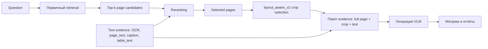

# 4 Метод

## 4.1 Общая схема pipeline

В данной работе исследуется pipeline мультимодального реранкинга для document question answering. Метод не направлен на создание нового retriever, новой VLM или общего multimodal RAG framework. Основной фокус находится на этапе reranking, который расположен между генерацией кандидатов и генерацией ответа. Retriever формирует начальный набор страниц-кандидатов, формирование evidence подготавливает визуальные и текстовые представления этих кандидатов, а VLM генерирует финальный ответ на основе выбранного evidence. Главный методологический вопрос состоит в том, как разные режимы reranking преобразуют шумный набор кандидатов retrieval в evidence, полезный для последующей генерации ответа.

Общий pipeline имеет следующую структуру:

```text
Question
-> Генерация кандидатов
-> Multimodal Reranking
-> Формирование evidence
-> Генерация ответа VLM
-> Evaluation
```

Задача генерации кандидатов состоит в том, чтобы получить достаточно широкий top-k набор потенциально релевантных страниц. Этот этап рассматривается как источник кандидатов, а не как главный объект исследования. Задача мультимодального реранкинга состоит в том, чтобы переупорядочить эти кандидаты по их ожидаемой полезности для ответа на вопрос. Затем формирование evidence преобразует выбранные страницы в пакет входных данных, включающий полные изображения страниц, layout-aware crops и, при наличии, текстовый evidence. Наконец, VLM выступает моделью генерации ответа, которая показывает, достаточно ли evidence, выбранного reranker для получения правильного ответа.

Схема реализованного pipeline приведена ниже.



Такая архитектура делает reranking главной точкой принятия решения в системе. Retriever первичного этапа может найти правильный документ, но при этом вернуть нерелевантные или визуально похожие страницы на высоких позициях. Reranker отвечает за разрешение этой неоднозначности до того, как evidence будет упакован и передан в VLM. Поэтому эффективность всего document QA pipeline оценивается через поведение этапа реранкинга при разных условиях генерации кандидатов, формирования evidence и выбора VLM-модели.

Экспериментальный дизайн включает три режима reranking. Первый режим — **No Reranker**, где кандидаты от retriever сразу передаются в формирование evidence. Второй режим — **Text Reranker**, где text-only cross-encoder или reranking model переупорядочивает кандидатов на основе извлечённого текста страницы. Третий режим — **Multimodal Reranker**, где для reranking используются визуальный и текстовый evidence страницы. Последовательность `No Reranker -> Text Reranker -> Multimodal Reranker` является основной методологической осью статьи.

## 4.2 Генерация кандидатов

Генерация кандидатов является первым этапом pipeline. Её задача — сформировать достаточно широкий набор страниц-кандидатов для последующего reranking. Поскольку статья посвящена мультимодальному reranking, генерация кандидатов не рассматривается как финальное retrieval-решение. Она определяет только пул кандидатов, который reranker может улучшить. Если правильная страница или документ отсутствует в этом пуле, последующий reranker уже не сможет восстановить этот evidence. Если же пул содержит релевантные и нерелевантные страницы, именно reranker определяет, попадёт ли в финальный пакет evidence правильная страница, таблица, рисунок или текстовый фрагмент.

В экспериментах используются несколько реально реализованных backend-ов генерации кандидатов.

**Nemotron image retrieval** является основным визуальным candidate generator в сильнейших мультимодальных конфигурациях. Он извлекает страницы на основе image-based representations документов. В этой постановке запрос сопоставляется с page image embeddings, а retriever возвращает top-k страниц для reranker. Такой режим особенно важен для визуально насыщенных страниц, таблиц, графиков и layout-dependent evidence, поскольку candidate generator не ограничен только извлечённым текстом.

**ColPali / ColVision** — второе семейство visual retrieval, использованное в экспериментах. Оно представляет отрендеренные страницы документов с помощью vision-language retrieval и late interaction. В нашем pipeline ColPali/ColVision применяется для генерации страниц-кандидатов, которые затем передаются на этап реранкинга. Здесь этот компонент не рассматривается как самостоятельный retrieval benchmark; это одно из условий генерации кандидатов, в котором измеряется эффективность reranking.

**BM25 page_text** — lexical text-based candidate generator. Он использует извлечённый `page_text` и возвращает страницы на основе лексического совпадения с вопросом. Этот candidate generator поддерживает ветку текстового реранкинга и служит лёгким baseline для text-only evidence. Он полезен для вопросов, где ответ явно выражен в тексте страницы, но может пропускать evidence, зафиксированный в layout, таблицах или визуальных областях.

**BGE-base text encoder** и **BGE-large text encoder** — dense text encoder варианты для page-level text evidence retrieval. Эти encoders работают с доступным текстовым evidence и формируют страницы-кандидаты для текстового реранкинга или no-reranker сравнения. Они используются для проверки того, может ли более сильное текстовое представление улучшить пул кандидатов перед reranking.

Во всех режимах в генерации кандидатов действует один принцип: retriever отвечает за поиск кандидатов с упором на полноту, а reranking отвечает за отбор evidence с упором на точность. Такое разделение важно, поскольку оно не позволяет позиционировать работу как retrieval benchmark. Ключевое сравнение заключается не в том, какой retriever лучше сам по себе, а в том, как разные пулы кандидатов влияют на эффективность text reranking и мультимодального реранкинга.

## 4.3 Предлагаемая мультимодальная стратегия реранкинга

Предлагаемый метод представляет собой мультимодальную стратегию reranking для document question answering. Он не заявляет новую архитектуру reranker-компонента и не включает отдельный этап обучения модели. Вместо этого метод задаёт воспроизводимый pipeline реранкинга, который сравнивает, как существующие режимы reranking работают с мультимодальным PDF evidence. Стратегия построена вокруг практического наблюдения: первичный retrieval часто слишком груб для document QA. Он может найти правильный документ, но поставить неправильную страницу выше правильной, либо вернуть страницы, семантически близкие к вопросу, но визуально нерелевантные для ответа.

Предлагаемая мультимодальная стратегия реранкинга является основным практическим вкладом работы. Вместо введения новой архитектуры reranker предлагается воспроизводимый pipeline для document question answering, объединяющий retrieval кандидатов, мультимодальный реранкинг, layout-aware выбор evidence и генерацию ответа на основе VLM. Такая схема позволяет контролируемо анализировать эффективность реранкинга при разных условиях retrieval, формирования evidence и генерации.

Reranking необходим, потому что PDF-документы содержат несколько типов неоднозначности. Во-первых, retrieval noise является обычной ситуацией: candidate set может включать страницы из того же документа, соседних разделов или документов с похожей терминологией. Во-вторых, визуально похожие страницы могут содержать повторяющиеся таблицы, схожие заголовки, однотипные графики или финансовые отчётные формы. В-третьих, duplicate или near-duplicate tables могут встречаться в годовых отчётах, приложениях и сравнительных разделах. В-четвёртых, evidence может быть неоднозначным: одна и та же сущность или метрика встречается на нескольких страницах, но только одна страница содержит значение, требуемое вопросом. В этих случаях генерации кандидатов недостаточно. Reranker должен определить, какой кандидат наиболее полезен для ответа на конкретный вопрос.

Стратегия реранкинга оценивается через три режима.

### No Reranker

Режим no-reranker является самым простым baseline. Top candidates, возвращённые retriever, сразу передаются в формирование evidence. Второй stage model не переупорядочивает их. Этот режим важен, потому что он показывает, какую долю итогового качества можно получить только за счёт генерации кандидатов. Он также даёт самые быстрые варианты pipeline, поскольку исключает дополнительную latency от cross-encoder или visual-language reranking.

Однако no-reranker pipelines чувствительны к retrieval noise. Если правильная страница не находится достаточно высоко в ранжировании retriever первичного этапа, она может не попасть в выбранный evidence для VLM. Даже если правильный документ найден, выбранная страница может содержать похожую, но неправильную таблицу, схожий график или соседнее текстовое объяснение, которое не отвечает на вопрос. Поэтому no-reranker режим служит нижней точкой сравнения для оценки вклада reranking.

### Text Reranker

Режим text-reranker добавляет модель второго этапа, которая переупорядочивает кандидатов с использованием текстового evidence страницы. В экспериментах используются следующие реальные text rerankers:

- `BAAI/bge-reranker-base`;
- `BAAI/bge-reranker-large`;
- `jinaai/jina-reranker-v2-base-multilingual`;
- `cross-encoder/ms-marco-MiniLM-L-6-v2`.

Эти модели используют text-only representations страниц-кандидатов. В зависимости от эксперимента текст может поступать из `page_text` или из расширенного текстового evidence. Reranker получает вопрос и текстовое представление каждой страницы-кандидата, после чего присваивает relevance scores, используемые для переупорядочивания candidate list.

Текстовый реранкинг имеет несколько преимуществ. Он вычислительно дешевле, чем visual-language reranking, хорошо работает в случаях, когда ответ явно присутствует в тексте страницы, и задаёт сильный baseline для сравнения с мультимодальным реранкингом. Он также совместим с BM25 и dense text encoder candidate generation, что делает его полезным для lightweight document QA settings.

В то же время текстовый реранкинг ограничен качеством доступного текстового представления. Если релевантный evidence находится в структуре таблицы, графике, visual region или layout-dependent relationship, text-only reranker может не сохранить достаточно информации, чтобы выбрать лучшую страницу. OCR и текст страницы могут содержать нужные токены, но терять визуальное выравнивание. Captions и table text могут помочь, однако они всё равно не полностью представляют отрендеренную страницу. Поэтому текстовый реранкинг рассматривается как промежуточный baseline между no-reranker и настройками мультимодального реранкинга.

### Multimodal Reranker

Режим Multimodal Reranker является центральной методической постановкой. Он использует visual-language reranker для оценки candidates на основе вопроса и мультимодального page evidence. В экспериментах в качестве visual-language компонент реранкинга используется **Nemotron VL Reranker**. Этот reranker применяется после генерации кандидатов и до формирования evidence для генерации ответа.

Мультимодальный reranker может использовать информацию, недоступную text-only rerankers. Он учитывает изображение страницы, структуру layout, визуальные области, таблицы, графики и текстовое evidence. Это важно для document QA, потому что многие ответы зависят от пространственной организации текста. Например, числовое значение может быть правильным только в конкретной строке и колонке таблицы; ответ по графику может зависеть от подписей осей или визуальных аннотаций; вопрос по рисунку может требовать распознавания компонента или легенды. В таких случаях изображение страницы и layout дают сигналы релевантности, которые не могут быть полностью восстановлены из плоского текста.

Стратегия мультимодального реранкинга реализована как последовательность:

1. **Генерация кандидатов.** Retriever первичного этапа формирует top-k страниц-кандидатов из коллекции документов.
2. **Мультимодальный реранкинг.** Страницы-кандидаты оцениваются и переупорядочиваются с использованием вопроса, визуального evidence и текстового evidence страницы.
3. **Выбор страниц.** Top reranked pages выбираются для генерации ответа.
4. **Layout-aware crop selection.** Политика `layout_aware_v2` выбирает релевантные локальные crops, например таблицы или визуальные области, когда они доступны.
5. **Упаковка evidence.** Выбранные полные страницы, layout crops и дополнительный текстовый evidence упаковываются для VLM.
6. **VLM-генерация ответа.** VLM генерирует финальный ответ на основе пакета evidence, выбранного после реранкинга.

Эту стратегию следует понимать как pipeline реранкинга, а не как новую модель. Вклад работы состоит в контролируемом дизайне и оценке того, как мультимодальный реранкинг используется внутри document QA. Одна и та же идея reranking проверяется при разных генераторах кандидатов, режимах формирования evidence и моделях генерации. Это позволяет отделить эффект reranking от эффектов retrieval и размера VLM.

Основное предположение стратегии состоит в том, что мультимодальный реранкинг улучшает качество выбора evidence, когда релевантная информация визуально обоснована. Текстовый reranker может высоко оценить страницу из-за совпадающих слов, но multimodal reranker также использует page layout, tables, charts и visual regions. И наоборот, если вопрос отвечается из плоского текста, а retriever уже высоко ранжирует правильную страницу, дополнительная стоимость мультимодального реранкинга может быть неоправданной. Поэтому метод оценивает не только качество, но и стоимость по latency, связанную с reranking.

Такой дизайн напрямую поддерживает главную экспериментальную линию статьи: no reranking задаёт baseline генерации кандидатов, текстовый реранкинг измеряет ценность текстового second-stage ranking, а мультимодальный реранкинг измеряет дополнительную ценность использования визуального evidence страницы на этапе reranking.


### Почему важен мультимодальный реранкинг?

Основная гипотеза работы состоит в том, что мультимодальный реранкинг использует сигналы релевантности, недоступные text-only rerankers. Текстовый реранкинг опирается на лексическую и семантическую близость, извлечённую из текста страницы, тогда как мультимодальный реранкинг дополнительно учитывает layout страницы, таблицы, графики, рисунки и другие визуальные элементы документа. Эта дополнительная информация особенно важна для задач document question answering, где ответ зависит от пространственной структуры, визуальных связей или организации таблицы. Поэтому наибольший выигрыш от мультимодального реранкинга ожидается в визуально обоснованных сценариях document QA.

## 4.4 Формирование evidence

Формирование evidence подготавливает страницы-кандидаты для reranking и генерации ответа. В данной работе формирование evidence рассматривается как фактор, влияющий на эффективность reranking. Один и тот же reranker может вести себя по-разному в зависимости от того, получает ли он только текст страницы, полное изображение страницы, layout-aware crop или дополнительный OCR/table/caption evidence.

Главный режим evidence — **full page + layout crop**. В этом режиме VLM получает полное изображение страницы и, когда доступно, локальный crop, выбранный политикой `layout_aware_v2`. Crop может соответствовать таблице или другой layout region, релевантной вопросу. Этот режим является центральным для multimodal experiments, поскольку сохраняет как глобальный контекст страницы, так и локальную визуальную деталь. Для reranking этот режим evidence важен потому, что качество выбранных страниц определяет, сможет ли crop selection step показать генератору правильную таблицу, график или визуальный элемент.

Второй режим evidence — **page_text**. Это лёгкий текстовый baseline. Он использует извлечённый page-level text и применяется в BM25 retrieval и экспериментах с текстовым реранкингом. Преимущество `page_text` состоит в скорости и простоте. Ограничение состоит в том, что он может сглаживать или терять визуальную структуру. Для text rerankers `page_text` задаёт основной relevance signal. Если нужный evidence закодирован в layout, а не в плоском тексте, text reranker может ранжировать неправильную страницу или не отличить визуально разные страницы со схожим текстом.

Третий режим evidence — **OCR + page_text + captions + table_text**. Это расширенная текстовая evidence setting. Она дополняет текст страницы OCR-выводом, подписями и извлечённым table text, когда они доступны. Этот пакет evidence предназначен для проверки того, улучшают ли более богатые текстовые представления reranking и генерацию ответа. Он особенно релевантен для страниц, где отрендеренное изображение содержит текст, не сохранённый в исходном тексте страницы. В то же время расширенный текстовый evidence может увеличивать длину context и добавлять шум или дублирование.

Формирование evidence также влияет на различие между text reranking и мультимодальным реранкингом. Text rerankers работают только с текстовым evidence. Мультимодальные rerankers могут совместно использовать изображение страницы и text evidence. Поэтому формирование evidence не является простой деталью preprocessing. Оно определяет, какая информация доступна reranker, а значит, какой evidence будет передан в VLM.

## 4.5 Генерация ответа

Генерация ответа выполняется с помощью Qwen3-VL моделей. В экспериментах используются две реальные модели генерации ответа:

- `Qwen3-VL-30B`;
- `Qwen3-VL-8B`.

Эти модели не являются центральным объектом исследования. Они используются как модели генерации ответа, которые потребляют evidence, выбранный pipeline реранкинга. Цель включения разных VLM-моделей состоит в том, чтобы проверить, сохраняется ли эффект reranking при разных возможностях генерации. Поэтому VLM рассматривается как средство оценки evidence после реранкинга: если reranking выбирает правильные страницы и crops, VLM получает больше шансов сгенерировать правильный ответ; если reranking выбирает слабый evidence, даже более сильная VLM может сгенерировать неправильный или недостаточно обоснованный ответ.

В мультимодальных конфигурациях VLM получает изображения страниц и layout-aware crops. В настройках full image+text она также может получать текстовый evidence. В text-only конфигурациях VLM используется в режиме ответа по найденному и переупорядоченному текстовому контексту. Во всех конфигурациях этап генерации следует после reranking и потребляет уже выбранный evidence. Это различие важно для позиционирования статьи: работа не оценивает Qwen3-VL-30B и Qwen3-VL-8B как VLM benchmark. Вместо этого она изучает, как качество evidence после реранкинга влияет на генерацию ответа.

Промпт и настройки генерации фиксируются внутри соответствующих экспериментальных конфигураций. Это позволяет связывать различия между вариантами no-reranker, text-reranker и multimodal-reranker именно с выбором evidence, а не с изменениями промпта или поведения генерации.

## 4.6 Протокол оценки

Оценка проводится на мультимодальном подмножестве DocBench. Подмножество содержит 308 вопросов. Оцениваются следующие типы вопросов:

- `multimodal-t`;
- `multimodal-f`.

Категория `multimodal-t` покрывает table/text-heavy вопросы, где ответ часто зависит от табличного или текстово-насыщенного evidence. Категория `multimodal-f` покрывает figure/visual-heavy вопросы, где важнее изображения, графики, диаграммы или визуальные области. Такое разделение полезно для анализа реранкинга, поскольку текстовый реранкинг и мультимодальный реранкинг могут вести себя по-разному в зависимости от модальности required evidence.

Отчёты оценки включают метрики уровня ответа и retrieval-уровня. Метрики уровня ответа:

- Exact Match;
- Mean F1;
- F1 > 0.5;
- MM-T F1;
- MM-F F1.

Retrieval- и grounding-метрики включают document hit и page hit, когда они доступны. Также фиксируется latency, включая total latency и component-level latency там, где это возможно. Latency критически важна для данной работы, поскольку reranking улучшает выбор evidence ценой дополнительных вычислений. Поэтому метод reranking оценивается не только по качеству ответа, но и по влиянию на время inference.

Главная экспериментальная линия:

```text
No Reranker
-> Text Reranker
-> Multimodal Reranker
```

Все остальные компоненты оцениваются как факторы, влияющие на это сравнение. Candidate generators задают исходный pool страниц, доступный reranker. Формирование evidence задаёт текстовые и визуальные сигналы, которые reranker может использовать. VLM-модель задаёт последующую модель генерации, потребляющую evidence после реранкинга. Центральный вопрос состоит в том, даёт ли мультимодальный реранкинг измеримое преимущество над текстовым реранкингом и baseline-ами без реранкинга при контролируемых условиях.

Эксперименты задаются через `configs/experiments/*.yaml`, а результаты сохраняются в директориях `results` и `reports`. Такая configuration-driven организация делает сравнение воспроизводимым и фиксирует dataset split, типы вопросов, метрики и политики формирования evidence для вариантов реранкинга.

Следовательно, все эксперименты в работе направлены на количественную оценку вклада мультимодального реранкинга при контролируемых условиях retrieval, формирования evidence и выбора VLM. Основная цель состоит не в определении лучшего retriever или наиболее сильной VLM, а в понимании того, когда мультимодальный реранкинг даёт измеримые преимущества по сравнению с текстовым реранкингом и baseline-ами без реранкинга.
