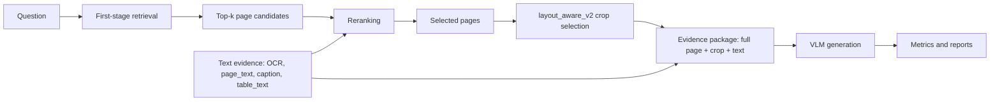

# Материалы для научной статьи

Источник: реальные артефакты репозитория:

- `reports/experiment_summary/main_table.csv`
- `reports/experiment_summary/component_aggregation.csv`
- `reports/experiment_summary/reranker_ablation.csv`
- `reports/experiment_summary/recommendations.csv`
- `reports/experiment_summary/paper_sections/paper_section_findings.md`
- `reports/tables/paper_multimodal_308.csv`

Документ не является готовым текстом статьи. Это структурированный набор материалов, чисел, тезисов и планов для написания научной статьи.

В основной сводной таблице найдено 20 экспериментов.

## A. Research Contribution

### Научная проблема

- В multimodal document QA по PDF ответ может находиться не только в plain text, но и в таблицах, графиках, диаграммах, подписях, OCR-тексте и локальных визуальных областях.
- First-stage retrieval часто находит релевантный документ или набор страниц, но итоговый ответ зависит от того, как reranker переупорядочивает кандидатов и выбирает evidence для VLM.
- Text rerankers используют только текстовые признаки и могут быть быстрым baseline, но ограничены для table/figure-heavy вопросов.
- Multimodal reranking способен использовать изображение страницы и текстовый evidence, однако заметно увеличивает latency; поэтому нужен quality-speed анализ именно reranking stage.

### Научная новизна

- Development and evaluation of a multimodal reranking strategy for document question answering.
- Систематическое сравнение режимов `No Reranker`, `Text Reranker` и `Multimodal Reranker` на одном multimodal DocBench subset из 308 вопросов.
- Анализ того, как first-stage retriever (`ColPali/ColVision`, `Nemotron image`, BM25/text encoders) влияет на эффективность последующего reranking.
- Сравнение text rerankers и visual-language reranking, включая `Nemotron VL reranker` и text+image reranking.
- Оценка влияния text evidence (`ocr`, `page_text`, `caption`, `table_text`) как входного условия для reranker, VLM input и score-level fusion.
- Отдельный анализ reranker effect по modality type, evidence strategy, VLM backbone и latency.

### Практическая значимость

- Best quality: `Nemotron full image+text + VL reranker + Qwen30B`, Mean F1 = 0.7023, F1>0.5 = 0.7565, latency = 13.6441s.
- Best fast option: `Fusion Nemotron no image reranker + Qwen30B`, Mean F1 = 0.6575, latency = 2.5080s.
- Best text-only baseline: `BM25 + BGE-reranker-large + Qwen30B`, Mean F1 = 0.5497, latency = 1.2344s.
- Результаты дают практическую основу для выбора между no-reranker быстрым режимом, text reranker baseline и более дорогим multimodal reranker.

### Основные исследовательские вопросы

- RQ1: Как first-stage retriever влияет на эффективность последующего reranking в multimodal DocBench?
- RQ2: Насколько режимы `No Reranker`, `Text Reranker` и `Multimodal Reranker` отличаются по качеству и latency cost?
- RQ3: Как VLM backbone влияет на наблюдаемый эффект reranking в имеющихся экспериментах?
- RQ4: Улучшает ли text evidence эффективность reranking при добавлении в reranker и VLM input?
- RQ5: Какие reranking configurations дают лучший quality-speed trade-off?
- RQ6: Отличается ли эффект reranking на `multimodal-t` и `multimodal-f`?

## B. Method Section Materials

### Proposed Multimodal Reranking Strategy

Метод позиционируется как исследование reranking stage внутри document QA pipeline. First-stage retriever формирует набор кандидатов, evidence construction задаёт представление страницы, VLM генерирует ответ, а центральным объектом анализа является reranker, который выбирает и переупорядочивает evidence перед генерацией.

Предлагаемый метод представляет собой мультимодальную стратегию reranking, которая объединяет:

- visual retrieval candidates;
- multimodal reranking;
- layout-aware crop selection;
- text evidence augmentation;
- VLM answer generation.

Лучший итоговый пайплайн:

```text
question
-> Nemotron image retriever
-> Nemotron text+image VL reranker
-> layout_aware_v2 page/crop selection
-> full page + layout crop + text evidence
-> Qwen3-VL-30B
-> answer
-> exact/F1/numeric/entity/unit/retrieval/latency metrics
```

### Схема пайплайна



### Retriever модели

| Retriever | Count | Mean F1 avg | Max Mean F1 | Mean latency | Best experiment |
| --- | ---: | ---: | ---: | ---: | --- |
| Nemotron image | 7 | 0.6791 | 0.7023 | 7.9438 | `image_text_full_308_nemotron_qwen3vl30b` |
| ColPali/ColVision | 5 | 0.6402 | 0.6860 | 11.5951 | `docbench_hybrid_bm25_tools_qwen3vl30b` |
| BM25 page_text | 5 | 0.5328 | 0.5497 | 0.8929 | `text_reranker_308_bge_large_qwen3vl30b` |
| BGE-large text encoder | 2 | 0.4889 | 0.5354 | 1.2528 | `text_evidence_encoder_308_bge_large_en_v1_5_bge_reranker_large_qwen3vl30b` |
| BGE-base text encoder | 1 | 0.5205 | 0.5205 | 1.4988 | `text_evidence_encoder_308_bge_base_en_v1_5_bge_reranker_large_qwen3vl30b` |

### Reranker модели

| Reranker | Count | Mean F1 avg | Max Mean F1 | Mean latency | Best experiment |
| --- | ---: | ---: | ---: | ---: | --- |
| Nemotron VL reranker | 7 | 0.6787 | 0.7023 | 12.7283 | `image_text_full_308_nemotron_qwen3vl30b` |
| None | 7 | 0.5943 | 0.6784 | 3.7420 | `image_text_full_308_nemotron_no_reranker_qwen3vl30b` |
| BGE-reranker-large | 3 | 0.5352 | 0.5497 | 1.4145 | `text_reranker_308_bge_large_qwen3vl30b` |
| BGE-reranker-base | 1 | 0.5429 | 0.5429 | 0.8689 | `text_reranker_308_bge_base_qwen3vl30b` |
| Jina reranker | 1 | 0.5303 | 0.5303 | 0.8927 | `text_reranker_308_jina_qwen3vl30b` |
| MiniLM reranker | 1 | 0.5265 | 0.5265 | 0.7538 | `text_reranker_308_minilm_qwen3vl30b` |

### VLM модели

| VLM | Count | Mean F1 avg | Max Mean F1 | Mean latency | Best experiment |
| --- | ---: | ---: | ---: | ---: | --- |
| Qwen3-VL-30B | 18 | 0.6074 | 0.7023 | 5.3796 | `image_text_full_308_nemotron_qwen3vl30b` |
| Qwen3-VL-8B | 2 | 0.5913 | 0.6170 | 12.6087 | `multimodal_308_with_reranker` |

Ограничение: сравнение 30B и 8B не полностью парное, так как для 30B проведено больше конфигураций.

### Evidence regimes

| Evidence | Count | Mean F1 avg | Max Mean F1 | Mean latency | Best experiment |
| --- | ---: | ---: | ---: | ---: | --- |
| full page + layout crop | 12 | 0.6629 | 0.7023 | 9.4652 | `image_text_full_308_nemotron_qwen3vl30b` |
| page_text | 5 | 0.5328 | 0.5497 | 0.8929 | `text_reranker_308_bge_large_qwen3vl30b` |
| OCR + page_text + captions + table_text | 3 | 0.4994 | 0.5354 | 1.3348 | `text_evidence_encoder_308_bge_large_en_v1_5_bge_reranker_large_qwen3vl30b` |

## C. Experiments Section Materials

Экспериментальный narrative строится вокруг последовательности `No Reranker -> Text Reranker -> Multimodal Reranker`. Retriever, evidence strategy и VLM backbone используются как условия, в которых измеряется эффект reranking. Сводная таблица ниже сохраняет все фактические результаты без изменений.

Главная экспериментальная линия статьи:

```text
No Reranker
-> Text Reranker
-> Multimodal Reranker
```

Все остальные эксперименты рассматриваются как факторы, влияющие на эффективность этой линии сравнения.

### Сводная таблица экспериментов

| Rank | Experiment | Family | Retriever | Reranker | VLM | Mean F1 | F1>0.5 | MM-T F1 | MM-F F1 | Latency |
| ---: | --- | --- | --- | --- | --- | ---: | ---: | ---: | ---: | ---: |
| 1 | Nemotron full image+text + VL reranker + Qwen30B | Full image+text | Nemotron image | Nemotron VL reranker | Qwen3-VL-30B | 0.7023 | 0.7565 | 0.7201 | 0.6578 | 13.6441 |
| 2 | Nemotron image+text input + VL reranker + Qwen30B | Image+text input | Nemotron image | Nemotron VL reranker | Qwen3-VL-30B | 0.6979 | 0.7468 | 0.7138 | 0.6579 | 12.9920 |
| 3 | Nemotron image + VL reranker + Qwen30B | Nemotron image retriever | Nemotron image | Nemotron VL reranker | Qwen3-VL-30B | 0.6902 | 0.7500 | 0.7015 | 0.6620 | 11.0702 |
| 4 | ColPali + VL reranker + Qwen30B | ColPali visual Qwen30B | ColPali/ColVision | Nemotron VL reranker | Qwen3-VL-30B | 0.6860 | 0.7338 | 0.6971 | 0.6582 | 14.8791 |
| 5 | Fusion Nemotron + VL reranker + Qwen30B | Image+text fusion | Nemotron image | Nemotron VL reranker | Qwen3-VL-30B | 0.6793 | 0.7175 | 0.6933 | 0.6445 | 9.4122 |
| 6 | Nemotron full image+text no reranker + Qwen30B | Full image+text | Nemotron image | None | Qwen3-VL-30B | 0.6784 | 0.7143 | 0.7029 | 0.6169 | 3.4263 |
| 7 | Fusion ColPali + VL reranker + Qwen30B | Image+text fusion | ColPali/ColVision | Nemotron VL reranker | Qwen3-VL-30B | 0.6782 | 0.7143 | 0.6906 | 0.6474 | 11.8085 |
| 8 | Fusion Nemotron no image reranker + Qwen30B | Image+text fusion | Nemotron image | None | Qwen3-VL-30B | 0.6575 | 0.6786 | 0.6786 | 0.6047 | 2.5080 |
| 9 | ColPali no reranker + Qwen30B | ColPali visual Qwen30B | ColPali/ColVision | None | Qwen3-VL-30B | 0.6539 | 0.6786 | 0.6718 | 0.6092 | 6.0709 |
| 10 | Nemotron image no reranker + Qwen30B | Nemotron image retriever | Nemotron image | None | Qwen3-VL-30B | 0.6479 | 0.6688 | 0.6655 | 0.6040 | 2.5535 |
| 11 | ColPali + VL reranker + Qwen8B | ColPali visual Qwen8B | ColPali/ColVision | Nemotron VL reranker | Qwen3-VL-8B | 0.6170 | 0.6201 | 0.6391 | 0.5617 | 15.2920 |
| 12 | ColPali no reranker + Qwen8B | ColPali visual Qwen8B | ColPali/ColVision | None | Qwen3-VL-8B | 0.5657 | 0.5747 | 0.5911 | 0.5020 | 9.9253 |
| 13 | BM25 + BGE-reranker-large + Qwen30B | BM25 text reranking | BM25 page_text | BGE-reranker-large | Qwen3-VL-30B | 0.5497 | 0.5714 | 0.5542 | 0.5385 | 1.2344 |
| 14 | BM25 + BGE-reranker-base + Qwen30B | BM25 text reranking | BM25 page_text | BGE-reranker-base | Qwen3-VL-30B | 0.5429 | 0.5617 | 0.5477 | 0.5309 | 0.8689 |
| 15 | BGE-large encoder + BGE-large reranker + Qwen30B | Text evidence encoder | BGE-large text encoder | BGE-reranker-large | Qwen3-VL-30B | 0.5354 | 0.5390 | 0.5646 | 0.4625 | 1.5102 |
| 16 | BM25 + Jina reranker + Qwen30B | BM25 text reranking | BM25 page_text | Jina reranker | Qwen3-VL-30B | 0.5303 | 0.5455 | 0.5501 | 0.4807 | 0.8927 |
| 17 | BM25 + MiniLM reranker + Qwen30B | BM25 text reranking | BM25 page_text | MiniLM reranker | Qwen3-VL-30B | 0.5265 | 0.5390 | 0.5463 | 0.4770 | 0.7538 |
| 18 | BGE-base encoder + BGE-large reranker + Qwen30B | Text evidence encoder | BGE-base text encoder | BGE-reranker-large | Qwen3-VL-30B | 0.5205 | 0.5390 | 0.5521 | 0.4414 | 1.4988 |
| 19 | BM25 no reranker + Qwen30B | BM25 text reranking | BM25 page_text | None | Qwen3-VL-30B | 0.5144 | 0.5325 | 0.5269 | 0.4830 | 0.7146 |
| 20 | BGE-large encoder no reranker + Qwen30B | Text evidence encoder | BGE-large text encoder | None | Qwen3-VL-30B | 0.4424 | 0.4545 | 0.4673 | 0.3801 | 0.9953 |

## D. Statistical Analysis

### Компоненты с наибольшим вкладом

- Лучший retriever group: `Nemotron image`, average Mean F1 = 0.6791.
- Лучший reranker group: `Nemotron VL reranker`, average Mean F1 = 0.6787.
- Лучший VLM group: `Qwen3-VL-30B`, average Mean F1 = 0.6074.
- Лучшая evidence strategy: `full page + layout crop`, average Mean F1 = 0.6629.

### Влияние reranking

| Comparison | Mean F1 no | Mean F1 with | Delta F1 | Latency no | Latency with | Delta latency |
| --- | ---: | ---: | ---: | ---: | ---: | ---: |
| ColPali Qwen8B VL reranker | 0.5657 | 0.6170 | 0.0513 | 9.9253 | 15.2920 | 5.3667 |
| ColPali Qwen30B VL reranker | 0.6539 | 0.6860 | 0.0321 | 6.0709 | 14.8791 | 8.8082 |
| Nemotron image Qwen30B VL reranker | 0.6479 | 0.6902 | 0.0423 | 2.5535 | 11.0702 | 8.5167 |
| Nemotron fusion Qwen30B image reranker | 0.6575 | 0.6793 | 0.0219 | 2.5080 | 9.4122 | 6.9042 |
| Nemotron full image+text Qwen30B text-image reranker | 0.6784 | 0.7023 | 0.0240 | 3.4263 | 13.6441 | 10.2179 |
| BM25 text BGE-large reranker | 0.5144 | 0.5497 | 0.0353 | 0.7146 | 1.2344 | 0.5198 |
| Text evidence BGE-large reranker | 0.4424 | 0.5354 | 0.0930 | 0.9953 | 1.5102 | 0.5149 |

- Средний прирост от reranker: +0.0428 Mean F1.
- Средний latency cost от reranker: +5.8355s.
- Максимальный прирост качества: `Text evidence BGE-large reranker`, Delta F1 = 0.0930.
- Самый дорогой latency cost: `Nemotron full image+text Qwen30B text-image reranker`, Delta latency = 10.2179s.

### Влияние размера VLM

- `Qwen3-VL-30B`: 18 experiments, average Mean F1 = 0.6074, max Mean F1 = 0.7023.
- `Qwen3-VL-8B`: 2 experiments, average Mean F1 = 0.5913, max Mean F1 = 0.6170.
- Ограничение: сравнение не полностью парное, так как для 30B проведено намного больше конфигураций.

### Влияние мультимодального контекста

- `full page + layout crop`: average Mean F1 = 0.6629.
- `page_text`: average Mean F1 = 0.5328.
- `OCR + page_text + captions + table_text`: average Mean F1 = 0.4994.
- Лучший итоговый метод использует визуальные страницы/crops и text evidence в full image+text режиме.

### Quality-speed trade-off

- Best quality: `image_text_full_308_nemotron_qwen3vl30b`, Mean F1 = 0.7023, latency = 13.6441s.
- Best speed при Mean F1 >= 0.65: `image_text_fusion_308_nemotron_no_reranker_qwen3vl30b`, Mean F1 = 0.6575, latency = 2.5080s.
- Best no-reranker variant: `image_text_full_308_nemotron_no_reranker_qwen3vl30b`, Mean F1 = 0.6784, latency = 3.4263s.
- Pareto frontier уже размечен в `reports/experiment_summary/main_table.csv` колонкой `pareto_frontier`.

## E. Figures

Список графиков, которые должны войти в статью:

1. Architecture diagram
   - Блок-схема Method pipeline.
   - Можно использовать Mermaid-схему из этого документа.

2. Retriever comparison
   - Bar plot по retriever group.
   - Данные: `reports/experiment_summary/paper_sections/5_3_retriever_analysis.csv`.
   - Ожидаемый файл: `reports/experiment_summary/paper_sections/figures/5_3_retriever_mean_f1.png`.

3. Reranker ablation
   - Bar plot Delta F1.
   - Данные: `reports/experiment_summary/paper_sections/5_4_reranker_ablation.csv`.
   - Ожидаемый файл: `reports/experiment_summary/paper_sections/figures/5_4_reranker_delta_f1.png`.

4. Reranker latency cost
   - Bar plot Delta latency.
   - Данные: `reports/experiment_summary/paper_sections/5_4_reranker_ablation.csv`.
   - Ожидаемый файл: `reports/experiment_summary/paper_sections/figures/5_4_reranker_delta_latency.png`.

5. VLM comparison
   - Bar plot Mean F1 по VLM group.
   - Данные: `reports/experiment_summary/paper_sections/5_5_vlm_analysis.csv`.
   - Ожидаемый файл: `reports/experiment_summary/paper_sections/figures/5_5_vlm_mean_f1.png`.

6. Modality analysis
   - Grouped bar plot MM-T F1 и MM-F F1 для top experiments.
   - Данные: `reports/experiment_summary/paper_sections/5_6_modality_analysis.csv`.
   - Ожидаемый файл: `reports/experiment_summary/paper_sections/figures/5_6_modality_top10_mmf.png`.

7. Quality-latency trade-off + Pareto frontier
   - Scatter plot: x = latency, y = Mean F1, цвет = family.
   - Данные: `reports/experiment_summary/main_table.csv`.
   - Ожидаемый файл: `reports/experiment_summary/paper_sections/figures/5_7_quality_speed_tradeoff.png`.

8. Top experiments ranking
   - Horizontal bar plot top-N по Mean F1.
   - Данные: `reports/experiment_summary/main_table.csv`.
   - Статус: отдельный файл для top ranking в текущем списке generated figures не найден; если нужен в статью, его надо добавить.

Если PNG отсутствуют локально, нужно установить `matplotlib` и `seaborn`, затем запустить:

```bash
python scripts/build_experiment_summary_tables.py
```

## F. Draft Structure

### 1. Abstract

- Кратко описать задачу multimodal document QA по PDF.
- Указать, что работа сравнивает retrieval, reranking, evidence и VLM strategies.
- Назвать evaluation setup: DocBench multimodal subset, 308 questions.
- Указать лучший результат: Mean F1 = 0.7023, F1>0.5 = 0.7565.
- Указать practical trade-off: Mean F1 = 0.6575 при latency = 2.5080s.

### 2. Introduction

- Описать проблему QA по PDF-документам.
- Объяснить, почему text-only RAG недостаточен для таблиц, графиков и визуальных evidence.
- Сформулировать гипотезу: мультимодальный reranking лучше выбирает evidence, когда ему доступны visual pages, layout-aware crops и text evidence.
- Перечислить contributions:
  - единый воспроизводимый pipeline для анализа reranking;
  - comparison No Reranker / Text Reranker / Multimodal Reranker;
  - анализ влияния retriever, evidence и VLM на reranker;
  - анализ latency/quality trade-off для reranking variants.
- Завершить исследовательскими вопросами RQ1-RQ6.

### 3. Related Work

- Document QA and multimodal evidence.
- Visual document retrieval as candidate generation for reranking.
- Text reranking, cross-encoder reranking and visual-language reranking.
- Multimodal RAG frameworks as context, not main positioning.
- OCR/table/caption evidence as reranker input.
- Quality-speed trade-off of reranking variants.

### 4. Method

- Описать общий pipeline вокруг reranking:
  - first-stage retrieval как candidate generation;
  - reranking как центральный stage;
  - page/crop selection как evidence preparation после reranking;
  - evidence packaging для VLM;
  - VLM generation как downstream evaluator of selected evidence;
  - evaluation.
- Описать retrievers как окружение для reranker:
  - `Nemotron image`;
  - `ColPali/ColVision`;
  - `BM25 page_text`;
  - `BGE-base text encoder`;
  - `BGE-large text encoder`.
- Описать rerankers:
  - `Nemotron VL reranker`;
  - `BGE-reranker-base`;
  - `BGE-reranker-large`;
  - `Jina reranker`;
  - `MiniLM reranker`;
  - `None`.
- Описать VLM как generation backbone, через который оценивается качество reranked evidence:
  - `Qwen3-VL-30B`;
  - `Qwen3-VL-8B`.
- Описать evidence strategies как входные представления для reranker и VLM:
  - `full page + layout crop`;
  - `page_text`;
  - `OCR + page_text + captions + table_text`.
- Добавить architecture diagram.
- Указать, что все параметры экспериментов зафиксированы в `configs/experiments/*.yaml`.

### 5. Experiments

- Dataset and setup:
  - DocBench multimodal 308 questions;
  - types: `multimodal-t`, `multimodal-f`.
- Metrics:
  - Exact Match;
  - Mean F1;
  - F1 > 0.5;
  - MM-T F1;
  - MM-F F1;
  - doc/page hit metrics;
  - latency.
- 5.3 Retriever Context for Reranking:
  - использовать `5_3_retriever_analysis.csv`;
  - показать, как candidate generator влияет на потолок качества reranker.
- 5.4 Reranker Analysis:
  - сделать центральным разделом Experiments;
  - выстроить narrative: `No Reranker -> Text Reranker -> Multimodal Reranker`;
  - использовать reranker aggregation и ablation;
  - средний reranker gain +0.0428 Mean F1;
  - средний latency cost +5.8355s.
- 5.5 VLM as Generation Backbone:
  - сравнить `Qwen3-VL-30B` и `Qwen3-VL-8B` только как backbones для оценки reranked evidence;
  - явно указать ограничение неполной парности экспериментов.
- 5.6 Modality Analysis:
  - сравнить MM-T и MM-F как разные условия для reranker;
  - показать gap и top MM-F experiments.
- 5.7 Quality-Speed Trade-off:
  - показать scatter/Pareto;
  - выделить best quality, best speed, best no-reranker как разные режимы reranking cost.

### 6. Conclusion

- Сформулировать главный результат через центральную линию reranking: мультимодальный VL reranker в full image+text setting даёт лучший итоговый результат.
- Сформулировать practical result: no-reranker/fusion варианты дают сильный speed-quality trade-off и являются важной точкой сравнения.
- Подчеркнуть, что reranking стабильно улучшает качество, но является latency bottleneck.
- Подчеркнуть роль text evidence как фактора, повышающего эффективность reranker и качество выбранного VLM evidence.

### 7. Discussion

- Обсудить ограничения:
  - 308 multimodal questions;
  - неполная парность всех VLM comparisons;
  - latency зависит от hardware и API/backend;
  - часть PNG может требовать установленного `matplotlib/seaborn`;
  - page/table gold annotations доступны не для всех случаев.
- Обсудить будущую работу:
  - ускорение text+image reranker;
  - расширение на другие datasets;
  - улучшение OCR/table evidence selection;
  - более строгие grounding metrics;
  - packaging больших индексов и artifacts.

## Данные, которых не хватает или которые ограничены

- Нет полного парного сравнения всех стратегий на Qwen3-VL-8B и Qwen3-VL-30B.
- Отдельный top experiments ranking plot пока не найден среди generated figures.
- PNG-графики могут отсутствовать локально, если они не были скачаны с сервера или если локально не установлен `matplotlib/seaborn`.
- `page_hit_at_k` и `table_hit_at_k` ограничены доступностью oracle page/table annotations.
